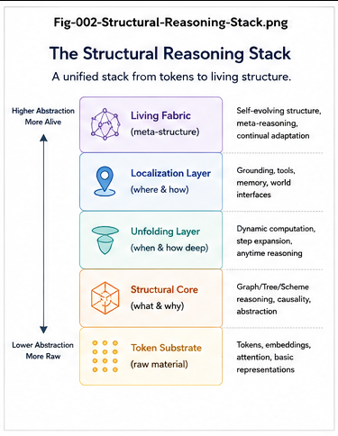

# STAR-002 — From Reasoning Answers to Structural Growth

## Why the Highest-Value Output of Reasoning May Be the Structure It Leaves Behind

**Repository:** Structural Theory of AI Reasoning
**Series:** STAR — Structural Theory of AI Reasoning
**Document:** STAR-002
**Status:** Core Theory Paper

---

## Abstract

Most AI reasoning systems are evaluated through their answers.

A question is presented, an inference process occurs, and an answer is produced:

$$
Q
\rightarrow
R
\rightarrow
A
$$

This model is useful, but it hides a potentially more important outcome of reasoning.

During reasoning, an intelligent system may discover:

* a new dependency;
* a better classification;
* a missing condition;
* a new causal link;
* a reusable procedure;
* a new task decomposition;
* a Calling Graph extension;
* a new CCC structure;
* a validated solution path.

If these products disappear when the answer is delivered, the reasoning episode remains largely transient.

If they are extracted, validated, preserved, and made reusable, then reasoning changes the intelligence structure available to future reasoning.

The lifecycle becomes:

$$
Q
\rightarrow
R
\rightarrow
A
\rightarrow
\Delta S
\rightarrow
S_{t+1}
$$

where \(\Delta S\) is the structural change created by reasoning.

This paper develops the distinction between **answer-oriented reasoning** and **growth-oriented reasoning**.

It argues that one of the most important transitions in future AI may be:

$$
\boxed{
Reasoning\ Output
\rightarrow
Reasoning\ Infrastructure
}
$$

The central proposition is:

> **The highest-value output of a reasoning process may not be the answer itself, but the reusable structure created in the process of reaching that answer.**

This transition provides a structural bridge from question answering toward persistent learning, cumulative intelligence, autonomous gap discovery, and living reasoning systems.

---



---

# 1. The Answer-Centered Model of Reasoning

The simplest representation of reasoning is:

$$
Question
\rightarrow
Reasoning
\rightarrow
Answer
$$

or:

$$
Q
\rightarrow
R
\rightarrow
A
$$

This model is deeply embedded in current AI evaluation.

A system is asked:

* a factual question;
* a mathematical question;
* a coding question;
* a planning question;
* a scientific question;
* a policy question.

The quality of reasoning is then judged primarily by the quality of the final answer.

This naturally creates an answer-centered objective:

$$
Value(R)
\approx
Value(A)
$$

The reasoning episode is successful if:

$$
A = Correct
$$

and unsuccessful if:

$$
A = Incorrect
$$

For many applications, this is sufficient.

But it leaves one major question unanswered:

> **What happened to the useful intelligence produced while the answer was being constructed?**

---

# 2. Reasoning Produces More Than Answers

A reasoning process frequently produces intermediate structures.

For example, an AI may discover:

* that two previously separate concepts are related;
* that one dependency must precede another;
* that a task should be decomposed into three subtasks;
* that an existing procedure contains a missing step;
* that a condition changes the valid solution path;
* that a graph contains a structural gap;
* that an action should become reusable;
* that a new category is required;
* that an existing abstraction is too coarse.

These discoveries are not merely linguistic artifacts.

They can be represented structurally.

Let:

$$
S_t
$$

represent the available intelligence structure before reasoning.

During reasoning, the system may discover a structural change:

$$
\Delta S_t
$$

The resulting structure becomes:

$$
S_{t+1}
=
S_t
+
\Delta S_t
$$

Thus reasoning may produce two outputs:

$$
\boxed{
R
\rightarrow
\{A,\Delta S\}
}
$$

where:

* \(A\) is the immediate answer;
* \(\Delta S\) is the structural contribution.

This is the starting point of growth-oriented reasoning.

---

# 3. Two Different Reasoning Lifecycles

The distinction can be expressed directly.

## 3.1 Answer-oriented reasoning

```text
Question
    |
    v
Reasoning
    |
    v
 Answer
    |
    v
   END
```

Formally:

$$
Q
\rightarrow
R
\rightarrow
A
$$

The answer is the terminal object.

---

## 3.2 Growth-oriented reasoning

```text
Question
    |
    v
Reasoning
    |
    v
 Answer
    |
    v
Structural Extraction
    |
    v
Validation
    |
    v
Preservation
    |
    v
Reusable Structure
    |
    v
Future Reasoning
```

Formally:

$$
Q
\rightarrow
R
\rightarrow
A
\rightarrow
\Delta S
\rightarrow
Validate(\Delta S)
\rightarrow
Preserve(\Delta S)
\rightarrow
S_{t+1}
$$

The key difference is simple:

$$
\boxed{
Answer\ is\ not\ necessarily\ the\ endpoint.
}
$$

---

# 4. Transient Reasoning and Persistent Reasoning

This distinction can be expressed through two categories.

## 4.1 Transient Reasoning

A reasoning process is transient when most of its useful intermediate structure exists only during the current episode.

For example:

$$
Context
\rightarrow
Reasoning
\rightarrow
Answer
$$

After the episode ends, much of the reasoning path may no longer exist as an independently callable object.

This does not imply that the reasoning was weak.

It only means that its structural products were not explicitly preserved.

We can represent this as:

$$
R_t
\rightarrow
A_t
$$

followed by:

$$
Structure_{preserved}
\approx 0
$$

---

## 4.2 Persistent Reasoning

A reasoning process becomes structurally persistent when useful reasoning products are extracted and promoted into reusable structure.

$$
R_t
\rightarrow
A_t
+
\Delta S_t
$$

followed by:

$$
Validate(\Delta S_t)
\rightarrow
Preserve(\Delta S_t)
$$

Then:

$$
S_{t+1}
=
S_t
+
\Delta S_t
$$

The next reasoning episode begins from a richer state.

This creates:

$$
\boxed{
Reasoning
\rightarrow
Persistent\ Structural\ Intelligence
}
$$

---

# 5. Why This Distinction Matters

Suppose a system solves the same class of problem repeatedly.

Under transient reasoning:

$$
P_1
\rightarrow
R_1
\rightarrow
A_1
$$

then later:

$$
P_2
\rightarrow
R_2
\rightarrow
A_2
$$

where much of \(R_2\) must reconstruct structure already discovered in \(R_1\).

This creates repeated reasoning cost.

Under structural growth:

$$
P_1
\rightarrow
R_1
\rightarrow
\Delta S_1
$$

then:

$$
P_2
+
\Delta S_1
\rightarrow
R_2'
\rightarrow
A_2
$$

where:

$$
Cost(R_2')
<
Cost(R_2)
$$

if the preserved structure is relevant and valid.

Thus structural growth can convert past reasoning expenditure into future reasoning capital.

---

# 6. Reasoning Capital

This leads to a useful concept:

$$
\boxed{
Reasoning\ Capital
}
$$

Reasoning capital is the reusable structural value accumulated from previous reasoning.

Examples include:

* validated decision branches;
* reusable task decompositions;
* proven dependencies;
* reusable Calling Graph fragments;
* CCC structures;
* named patterns;
* certified procedures;
* structural invariants;
* validated abstractions;
* known failure boundaries.

A reasoning system with substantial reasoning capital does not need to rediscover everything from first principles.

Instead:

$$
New\ Problem
+
Stored\ Structure
\rightarrow
Localized\ Reasoning
$$

This creates a cumulative intelligence effect.

---

# 7. The Structural Delta

The structural result of reasoning can be represented as:

$$
\Delta S_t
$$

This delta is central.

Not every reasoning episode should rewrite the whole intelligence structure.

Instead, reasoning may produce a localized change.

Examples:

$$
\Delta S_t
=
NewNode
$$

or:

$$
\Delta S_t
=
NewEdge
$$

or:

$$
\Delta S_t
=
NewCCC
$$

or:

$$
\Delta S_t
=
CorrectedDependency
$$

or:

$$
\Delta S_t
=
TaskGraphExtension
$$

or:

$$
\Delta S_t
=
NewGapBridge
$$

This creates a more realistic growth model:

$$
S_{t+1}
=
S_t
\oplus
\Delta S_t
$$

where \(\oplus\) represents a controlled structural update.

---

# 8. Reasoning Should Not Automatically Become Structure

Structural preservation is valuable, but automatic preservation would be dangerous.

Not every intermediate reasoning artifact deserves persistence.

Reasoning can contain:

* speculative hypotheses;
* low-confidence associations;
* temporary branches;
* exploratory dead ends;
* inconsistent candidates;
* context-specific assumptions;
* incorrect conclusions.

Therefore:

$$
Reasoning
\neq
Automatic\ Structural\ Promotion
$$

A safer lifecycle is:

$$
Candidate
\rightarrow
Evaluate
\rightarrow
Validate
\rightarrow
Promote
$$

Only qualified reasoning outputs should become persistent structural objects.

---

# 9. The Promotion Boundary

A central future research problem is:

> **When should a transient reasoning result become persistent structure?**

We can represent this as:

$$
Transient(R_i)
\xrightarrow{Promotion\ Policy}
Persistent(S_i)
$$

A promotion policy may evaluate:

* confidence;
* evidence;
* repeatability;
* utility;
* structural consistency;
* domain validity;
* provenance;
* contradiction risk;
* expected reuse;
* human approval;
* runtime validation.

Thus:

$$
Promote(\Delta S)
=
f(
Evidence,
Consistency,
Utility,
Risk,
Reuse
)
$$

This is not merely a memory-management problem.

It is a structural governance problem.

---

# 10. Structural Extraction

Before validation and preservation, useful reasoning structure must often be extracted.

A reasoning episode may contain rich but unstructured content:

$$
Reasoning\ Trace
$$

The system may need to transform this into:

$$
Explicit\ Structural\ Object
$$

For example:

```text
Temporary reasoning:

"If condition A is true and B has already occurred,
then operation C should precede D."
```

can be extracted as:

$$
Condition(A)
\land
State(B)
\rightarrow
C
\rightarrow
D
$$

The structural form may then become:

* a rule;
* a CCC;
* a graph edge;
* a new branch;
* a task dependency.

Thus:

$$
\boxed{
Reasoning
\rightarrow
Structural\ Extraction
}
$$

is an important computational stage.

---

# 11. Structural Validation

After extraction:

$$
Candidate\ Structure
$$

must be evaluated.

Validation may include:

### Logical validation

Does the structure contain internal contradiction?

### Runtime validation

Does it operate correctly when executed?

### Evidence validation

Is the claimed relationship supported by evidence?

### Structural validation

Does the new structure preserve required dependencies and invariants?

### Comparative validation

Does the new structure improve performance relative to the old structure?

### Human validation

Does a qualified human approve promotion?

This can be represented as:

$$
V(\Delta S)
\rightarrow
\{Accept,Reject,Revise\}
$$

Only after validation should:

$$
\Delta S
$$

enter persistent infrastructure.

---

# 12. Preservation Changes the Meaning of Reasoning

Once reasoning products are preserved, the reasoning system changes qualitatively.

Without preservation:

$$
R_t
\rightarrow
A_t
$$

With preservation:

$$
R_t
\rightarrow
A_t
+
S_{t+1}
$$

The second system accumulates intelligence structure over time.

This means:

$$
Reasoning_t
$$

changes:

$$
Reasoning_{t+1}
$$

indirectly by modifying its structural substrate.

Thus:

$$
\boxed{
Reasoning\ can\ modify\ future\ reasoning.
}
$$

This is a major transition.

---

# 13. The Reasoning-Growth Loop

Once persistent structural updates are possible:

$$
S_t
\xrightarrow{R_t}
\Delta S_t
$$

then:

$$
S_{t+1}
=
S_t
+
\Delta S_t
$$

and:

$$
S_{t+1}
\xrightarrow{R_{t+1}}
\Delta S_{t+1}
$$

The full loop is:

$$
\boxed{
S_t
\rightarrow
R_t
\rightarrow
\Delta S_t
\rightarrow
S_{t+1}
\rightarrow
R_{t+1}
}
$$

or:

```text
Existing Structure
        |
        v
     Reasoning
        |
        v
   Structural Delta
        |
        v
     Validation
        |
        v
     Preservation
        |
        v
   New Structure
        |
        v
   Future Reasoning
        |
        +------------->
```

This is the basic engine of structural growth.

---

# 14. Answer Value and Structural Value

A useful decomposition is:

$$
Value(R)
=
V_A
+
V_S
$$

where:

* \(V_A\) is the immediate value of the answer;
* \(V_S\) is the value of the reusable structure created.

In many routine tasks:

$$
V_A
\gg
V_S
$$

For example, a one-time weather question may require little persistent structural growth.

But in scientific research, software engineering, organizational learning, policy development, and autonomous system design:

$$
V_S
$$

may become very large.

Sometimes:

$$
\boxed{
V_S > V_A
}
$$

A single answer may be temporary.

A reusable structure may benefit hundreds or thousands of future reasoning processes.

---

# 15. The Compound Value of Structural Growth

Persistent reasoning structures can have compound value.

Suppose:

$$
\Delta S_1
$$

improves reasoning episode \(R_2\).

Then \(R_2\) produces:

$$
\Delta S_2
$$

which improves \(R_3\).

Thus:

$$
\Delta S_1
\rightarrow
R_2
\rightarrow
\Delta S_2
\rightarrow
R_3
\rightarrow
\Delta S_3
$$

This can produce cumulative structural improvement.

The value is no longer merely additive:

$$
V_1+V_2+V_3
$$

but may become compounding because earlier structures improve later reasoning productivity.

This suggests:

$$
\boxed{
Persistent\ Reasoning
\ can\ create
\ Compounding\ Intelligence.
}
$$

---

# 16. Localization Benefits from Structural Growth

Structural growth also improves future localization.

Suppose the initial reasoning space is poorly organized:

$$
Global\ Space
$$

Reasoning discovers useful divisions:

$$
Region_A,
Region_B,
Region_C
$$

These can become explicit localization structures.

Then future reasoning can use:

$$
Problem
\rightarrow
Region_B
\rightarrow
Local\ Reasoning
$$

instead of searching globally.

Thus:

$$
Reasoning
\rightarrow
Structural\ Growth
\rightarrow
Better\ Localization
$$

and:

$$
Better\ Localization
\rightarrow
More\ Efficient\ Reasoning
$$

forming another loop:

$$
\boxed{
Reasoning
\rightarrow
Structure
\rightarrow
Localization
\rightarrow
Better\ Reasoning
}
$$

---

# 17. Gap Detection Becomes Cumulative

Persistent structures make gaps visible.

Without an explicit structure, absence is difficult to define.

Once a graph, tree, task map, or dependency structure exists, the system can ask:

* Which node is missing?
* Which dependency is unsupported?
* Which branch terminates unexpectedly?
* Which task has no executable action?
* Which condition lacks computation?
* Which structural path is incomplete?

Thus:

$$
Explicit\ Structure
\rightarrow
Visible\ Gap
$$

and:

$$
Visible\ Gap
\rightarrow
New\ Reasoning
$$

This creates:

$$
\boxed{
Structure
\rightarrow
Gap
\rightarrow
Reasoning
\rightarrow
More\ Structure
}
$$

This is one reason persistent structural intelligence can become progressively more powerful.

---

# 18. Gap Bridging as Structural Growth

When a gap is detected:

$$
G_t
$$

reasoning may generate candidate bridges:

$$
B_1,B_2,\ldots,B_n
$$

After evaluation:

$$
B^*
=
Select(B_1,\ldots,B_n)
$$

and validation:

$$
Validate(B^*)
$$

the bridge can become part of the permanent structure:

$$
S_{t+1}
=
S_t
+
B^*
$$

Thus Gap Bridging is not only problem solving.

It is also a mechanism of structural growth.

---

# 19. Forward Extension Goes Beyond Gap Repair

A reasoning system can also ask:

> **What useful structure should exist next even if no explicit failure has occurred?**

This is Forward Extension.

$$
S_t
\rightarrow
Candidate\ Future\ Structure
$$

The system may create:

* new hypotheses;
* new tasks;
* new experiments;
* new program paths;
* new categories;
* new reasoning branches;
* new action capabilities.

Thus structural growth has at least two modes:

$$
\boxed{
Reactive\ Growth
=
Gap\ Bridging
}
$$

and:

$$
\boxed{
Proactive\ Growth
=
Forward\ Extension
}
$$

This distinction becomes important for autonomous intelligence.

---

# 20. TaskGraph Growth

Task reasoning provides a clear example.

Suppose:

$$
Task_0
$$

is decomposed into:

$$
Task_1,
Task_2,
Task_3
$$

Reasoning then discovers that:

$$
Task_2
$$

requires a previously unknown subtask:

$$
Task_{2.1}
$$

The TaskGraph changes:

$$
TG_t
\rightarrow
TG_{t+1}
$$

This is not merely an answer.

The reasoning process has created a better representation of the task itself.

Future planning can now operate from:

$$
TG_{t+1}
$$

This is structural growth in a direct and practical form.

---

# 21. Action Calling Graph Growth

A similar process occurs in execution.

Suppose an Action Calling Graph contains:

$$
A
\rightarrow
B
\rightarrow
D
$$

but execution reveals that:

$$
B
\rightarrow
D
$$

is invalid without:

$$
C
$$

Reasoning detects:

$$
Gap(B,D)
$$

constructs:

$$
B
\rightarrow
C
\rightarrow
D
$$

validates the new sequence, then preserves it.

The system now possesses a better executable structure.

Thus:

$$
Execution
\rightarrow
Evidence
\rightarrow
Reasoning
\rightarrow
Graph\ Growth
$$

This links action and reasoning.

---

# 22. Core-Preserved Growth

Structural growth must not destroy valid existing structure unnecessarily.

This gives the principle:

$$
\boxed{
Growth
\ should\ preserve
\ validated\ core\ structure.
}
$$

Let:

$$
C_t
\subseteq
S_t
$$

be the validated core.

A growth operation should seek:

$$
S_{t+1}
=
C_t
+
\Delta S
$$

subject to:

$$
Preserve(C_t)
=
True
$$

unless new evidence explicitly invalidates the core.

This connects structural reasoning with Core-Preserved Generation.

The same principle appears in both coding and reasoning:

### Coding

$$
Existing\ Program\ Core
\rightarrow
Validated\ Extension
$$

### Reasoning

$$
Existing\ Knowledge/Task\ Core
\rightarrow
Validated\ Structural\ Extension
$$

This is a deep structural duality.

---

# 23. Reasoning Growth and Learning

Structural growth begins to blur the boundary between reasoning and learning.

Traditional separation often implies:

$$
Training
\rightarrow
Learn
$$

and:

$$
Inference
\rightarrow
Reason
$$

But if inference produces:

$$
\Delta S
$$

and that structure persists:

$$
S_{t+1}
=
S_t
+
\Delta S
$$

then reasoning has changed the system's future capability.

This raises an important question:

> **At what point does persistent reasoning become learning?**

A useful distinction may be:

### Parameter learning

Changes:

$$
\theta_t
\rightarrow
\theta_{t+1}
$$

### Structural learning

Changes:

$$
S_t
\rightarrow
S_{t+1}
$$

These mechanisms can coexist.

A system may learn without changing model parameters if it creates persistent external or runtime structures that alter future behavior.

---

# 24. Reasoning Growth and Collective Learning

Structural preservation also changes the social scale of reasoning.

Suppose one reasoning process creates:

$$
\Delta S
$$

If the result remains private and transient, only one reasoning episode benefits.

If it becomes a validated shared structural object, then:

$$
\Delta S
\rightarrow
Collective\ Reuse
$$

Many future reasoning processes can begin from that result.

This changes:

$$
Individual\ Reasoning
$$

into:

$$
\boxed{
Collective\ Learning
}
$$

The lifecycle becomes:

$$
Individual\ Reasoning
\rightarrow
Structural\ Extraction
\rightarrow
Validation
\rightarrow
Shared\ Structure
\rightarrow
Collective\ Reuse
$$

This is one of the most important reasons to convert reasoning products into explicit structures.

---

# 25. LLM Reasoning and Structural Growth

LLMs can generate sophisticated reasoning trajectories.

They can produce:

* classifications;
* hypotheses;
* abstractions;
* plans;
* explanations;
* dependencies;
* candidate structures.

However, many of these products are naturally transient unless an external mechanism preserves them.

Thus a useful distinction is:

$$
LLM\ Reasoning
\rightarrow
Candidate\ Intelligence
$$

followed by:

$$
Structural\ System
\rightarrow
Extract
\rightarrow
Validate
\rightarrow
Preserve
$$

This does not diminish LLM reasoning.

It identifies a powerful division of labor.

LLMs can be exceptional generators of candidate reasoning structure.

Structural Intelligence can help turn selected candidates into persistent, addressable, governed reasoning infrastructure.

---

# 26. Transient Structural Intelligence

This suggests another useful concept:

$$
\boxed{
Transient\ Structural\ Intelligence
}
$$

During reasoning, an LLM or other AI system may temporarily construct:

* local classifications;
* dependency chains;
* plans;
* conceptual mappings;
* problem decompositions;
* reasoning trees.

These structures may be highly intelligent.

But they may disappear with the context.

Thus:

$$
Transient\ Structure
\neq
Persistent\ Infrastructure
$$

The transition:

$$
Transient
\rightarrow
Persistent
$$

is therefore a central operation in future reasoning systems.

---

# 27. Persistent Operational Structural Intelligence

Once reasoning structures are:

* explicitly represented;
* named;
* typed;
* validated;
* callable;
* auditable;
* reusable;

they become:

$$
\boxed{
Persistent\ Operational\ Structural\ Intelligence
}
$$

The intelligence is no longer only demonstrated in behavior.

It is embodied in reusable computational structure.

This changes the system from:

> capable of reasoning

to:

> capable of accumulating reasoning infrastructure.

That is a major architectural transition.

---

# 28. A Structural Reasoning Memory Is Not Just a Log

It is important to distinguish structural preservation from simple logging.

A reasoning log stores:

$$
History
$$

A structural reasoning memory stores:

$$
Reusable\ Structure
$$

For example, preserving:

```text
"The model considered A, B, C, then chose D."
```

is a trace.

Preserving:

$$
Condition(X)
\rightarrow
Branch(B)
\rightarrow
Action(D)
$$

is an operational structure.

Thus:

$$
\boxed{
Reasoning\ Memory
\neq
Reasoning\ Transcript
}
$$

A transcript records what happened.

A structural memory records what can be reused.

---

# 29. The Structural Growth Pipeline

A practical structural growth pipeline can be represented as:

```text
Reasoning Episode
       |
       v
Candidate Insights
       |
       v
Structural Extraction
       |
       v
Candidate Delta
       |
       v
Validation
       |
   +---+---+
   |       |
Reject   Accept
           |
           v
       Promotion
           |
           v
      Preservation
           |
           v
     Reusable Structure
           |
           v
      Future Reasoning
```

This pipeline turns reasoning output into infrastructure.

---

# 30. A Minimal Growth Equation

The entire paper can be reduced to:

$$
\boxed{
S_{t+1}
=
S_t
+
V(E(R_t))
}
$$

where:

* \(R_t\) = reasoning;
* \(E\) = structural extraction;
* \(V\) = validation and promotion;
* \(S_t\) = current structure;
* \(S_{t+1}\) = resulting structure.

This is not intended as a complete mathematical theory.

It is a compact representation of the structural growth process.

---

# 31. Growth Quality

More structural growth is not always better.

A system that preserves every reasoning artifact may accumulate noise.

Therefore the objective should not be:

$$
Maximize(|\Delta S|)
$$

but:

$$
\boxed{
Maximize
\left(
\frac{
Useful\ Validated\ Structural\ Growth
}{
Reasoning\ and\ Maintenance\ Cost
}
\right)
}
$$

The important word is:

$$
Validated
$$

A small amount of high-quality structural growth may be more valuable than a large amount of unverified structure.

---

# 32. Structural Debt

Poorly governed structural growth can also create:

$$
\boxed{
Structural\ Debt
}
$$

Examples include:

* duplicated structures;
* inconsistent branches;
* obsolete dependencies;
* weakly validated rules;
* contradictory CCCs;
* poorly named objects;
* excessive graph complexity.

Thus growth requires maintenance.

A mature reasoning system needs operations for:

$$
Create
$$

$$
Validate
$$

$$
Merge
$$

$$
Refactor
$$

$$
Deprecate
$$

$$
Delete
$$

Structural intelligence therefore requires not only growth, but structural governance.

---

# 33. Growth and Compression

Persistent reasoning growth does not imply infinite structural expansion.

New structures may later be compressed.

Several reasoning results may reveal a common abstraction:

$$
S_1,
S_2,
S_3
\rightarrow
S^*
$$

This is a form of structural folding.

Thus long-term intelligence may alternate between:

$$
Expansion
$$

and:

$$
Compression
$$

or:

$$
Unfold
\rightarrow
Reason
\rightarrow
Grow
\rightarrow
Abstract
\rightarrow
Refold
$$

This connects structural growth with the later Folding/Unfolding theory of LLM reasoning.

---

# 34. From Answering to Growing

We can now define three broad stages.

## Stage 1 — Answering

$$
Question
\rightarrow
Answer
$$

The system provides useful outputs.

---

## Stage 2 — Reasoning

$$
Question
\rightarrow
Multi\text{-}Step\ Computation
\rightarrow
Answer
$$

The system produces stronger solutions.

---

## Stage 3 — Growing

$$
Question
\rightarrow
Reasoning
\rightarrow
Structural\ Delta
\rightarrow
Validation
\rightarrow
Preservation
\rightarrow
Future\ Capability
$$

The system improves the structural substrate of future reasoning.

Thus:

$$
\boxed{
Answering
\rightarrow
Reasoning
\rightarrow
Growing
}
$$

This progression is central to the Structural Theory of AI Reasoning.

---

# 35. Toward Living Reasoning

When reasoning continuously modifies future reasoning structure:

$$
R_t
\rightarrow
S_{t+1}
$$

and the new structure affects:

$$
R_{t+1}
$$

the system forms a feedback loop:

$$
R_t
\rightarrow
S_{t+1}
\rightarrow
R_{t+1}
\rightarrow
S_{t+2}
$$

This can be called:

$$
\boxed{
Living\ Reasoning
}
$$

Again, "living" does not imply consciousness.

It refers to an adaptive structural loop in which intelligence changes the infrastructure through which future intelligence operates.

---

# 36. From Reactive Reasoning to Autonomous Growth

A conventional system waits for:

$$
Question
$$

A more advanced system can detect:

$$
Gap
$$

without an explicit external question.

Then:

$$
Gap
\rightarrow
Reasoning
\rightarrow
Bridge
\rightarrow
Validation
\rightarrow
Growth
$$

An even more advanced system can perform:

$$
Forward\ Extension
$$

without waiting for an explicit failure.

Thus:

$$
External\ Question
$$

can gradually be supplemented by:

$$
Internal\ Structural\ Trigger
$$

This produces a progression:

$$
QA
\rightarrow
Gap\text{-}Driven\ Reasoning
\rightarrow
Self\text{-}Directed\ Structural\ Growth
$$

This is one plausible structural path toward autonomous structural intelligence.

---

# 37. A Canonical Comparison

The distinction between answer-oriented reasoning and structural-growth reasoning can be summarized as follows:

| Dimension            | Answer-Oriented Reasoning | Structural-Growth Reasoning    |
| -------------------- | ------------------------- | ------------------------------ |
| Primary output       | Answer                    | Answer + structural delta      |
| Endpoint             | Response completion       | Updated reasoning structure    |
| Persistence          | Often temporary           | Explicitly preserved           |
| Reuse                | Limited or indirect       | First-class objective          |
| Gap handling         | Solve current problem     | Solve and preserve bridge      |
| Learning effect      | Episodic                  | Cumulative                     |
| Future reasoning     | Starts largely fresh      | Starts from enriched structure |
| Validation           | Answer correctness        | Answer + structural validation |
| Memory               | Transcript/context        | Operational structure          |
| Growth               | Optional                  | Core property                  |
| Collective reuse     | Limited                   | Natural                        |
| Autonomous evolution | Weak                      | Structurally enabled           |

This table captures the central transition of this paper.

---

# 38. Core Propositions

## Proposition 1 — Answers are only one reasoning product

$$
\boxed{
R
\rightarrow
A
+
\Delta S
}
$$

---

## Proposition 2 — Structural growth creates future reasoning value

$$
\boxed{
\Delta S_t
\rightarrow
Better\ R_{t+1}
}
$$

---

## Proposition 3 — Structural promotion must be selective

$$
\boxed{
Candidate
\rightarrow
Validation
\rightarrow
Promotion
}
$$

---

## Proposition 4 — Persistent reasoning creates reasoning capital

$$
\boxed{
Past\ Reasoning
\rightarrow
Reusable\ Structural\ Capital
}
$$

---

## Proposition 5 — Explicit structure makes gaps observable

$$
\boxed{
Structure
\rightarrow
Gap\ Visibility
}
$$

---

## Proposition 6 — Gap Bridging and Forward Extension are growth mechanisms

$$
\boxed{
Gap\ Bridging
+
Forward\ Extension
\rightarrow
Structural\ Growth
}
$$

---

## Proposition 7 — Reasoning and learning can converge through persistence

$$
\boxed{
Reasoning
+
Persistence
\rightarrow
Structural\ Learning
}
$$

---

## Proposition 8 — Growth can become self-reinforcing

$$
\boxed{
Reasoning
\rightarrow
Structure
\rightarrow
Better\ Reasoning
}
$$

---

# 39. Research Questions

### RQ-1 — What kinds of reasoning results deserve structural promotion?

What criteria distinguish reusable structure from temporary thought?

### RQ-2 — How should structural deltas be represented?

Should they be:

* graphs;
* CCCs;
* rules;
* typed nodes;
* programs;
* Runtime Invariants;
* task structures;
* hybrid objects?

### RQ-3 — How can structural validation be automated?

Can systems distinguish:

$$
Useful\ Structure
$$

from:

$$
Plausible\ but\ Incorrect\ Structure
$$

reliably?

### RQ-4 — How much structural growth is optimal?

How should systems balance:

$$
Growth
$$

against:

$$
Complexity
$$

and:

$$
Structural\ Debt
$$

### RQ-5 — How should old and new structures be merged?

What happens when:

$$
\Delta S_{new}
$$

conflicts with:

$$
S_{existing}
$$

### RQ-6 — How should structural reasoning capital be measured?

Possible measures include:

$$
Reuse\ Rate
$$

$$
Reasoning\ Cost\ Reduction
$$

$$
Gap\ Resolution\ Rate
$$

$$
Structural\ Stability
$$

### RQ-7 — When does structural reasoning become autonomous learning?

What threshold separates:

$$
Persistent\ Reasoning
$$

from:

$$
Autonomous\ Structural\ Evolution
$$

### RQ-8 — Can collective reasoning create shared structural intelligence?

How should structures produced by many humans and AI systems be validated, merged, governed, and reused?

---

# 40. Central Thesis

The central thesis of this paper is:

> **An answer completes a reasoning episode; a validated reusable structure can change the intelligence available to every reasoning episode that follows.**

In compact form:

$$
\boxed{
Answer
=
Immediate\ Value
}
$$

while:

$$
\boxed{
Validated\ Structure
=
Persistent\ Value
}
$$

Therefore:

$$
\boxed{
The\ highest\text{-}value\ output\ of\ reasoning
\ may\ be\ the\ structure\ it\ leaves\ behind.
}
$$

---

# 41. Canonical Equation

The reasoning-growth lifecycle can be summarized as:

$$
\boxed{
Question
\rightarrow
Reasoning
\rightarrow
Answer
\rightarrow
Structural\ Extraction
\rightarrow
Validation
\rightarrow
Preservation
\rightarrow
Structural\ Growth
\rightarrow
Future\ Reasoning
}
$$

Or more compactly:

$$
\boxed{
R_t(S_t)
\rightarrow
\Delta S_t
\rightarrow
S_{t+1}
\rightarrow
R_{t+1}(S_{t+1})
}
$$

This is the basic structural cycle underlying persistent reasoning.

---

# 42. Conclusion

AI reasoning is often judged by what it says at the end.

That is necessary.

But it may not be sufficient.

A sophisticated reasoning system can produce more than an answer.

It can produce:

* new relationships;
* better classifications;
* improved task structures;
* reusable procedures;
* gap bridges;
* Forward Extensions;
* validated computational structures.

If these results remain temporary, reasoning remains primarily episodic.

If they become explicit, validated, persistent, and reusable, reasoning begins to accumulate infrastructure.

The critical transition is:

$$
\boxed{
Reasoning\ Output
\rightarrow
Reasoning\ Infrastructure
}
$$

This changes the developmental trajectory of AI.

Instead of repeatedly asking:

> **Can the system answer this question?**

we can also ask:

> **What did the system learn structurally by answering it?**

and:

> **What reusable intelligence did this reasoning episode leave behind?**

These questions move AI reasoning from response quality toward cumulative intelligence.

They also establish the foundation for the next stage of this theory.

If reasoning can create persistent structures, then we must ask how different reasoning systems reach the local structures on which reasoning operates.

Structural Intelligence emphasizes:

$$
Localization
$$

while LLM reasoning may be interpreted through:

$$
Selective\ Unfolding
$$

The convergence of these two processes will become one of the central themes of the Structural Theory of AI Reasoning.

---

## Next

**STAR-003 — How Structural Intelligence Reasons**

The next paper develops the explicit structural reasoning stack:

$$
\boxed{
Localization
\rightarrow
Per\text{-}Node\ Intelligence
\rightarrow
Structural\ Traversal
\rightarrow
Gap\ Detection
\rightarrow
Gap\ Bridging
\rightarrow
Forward\ Extension
\rightarrow
Validation
\rightarrow
Structural\ Growth
}
$$

It asks how Structural Intelligence converts reasoning from an implicit episode into an explicit, inspectable, extensible, and persistent computational process.
