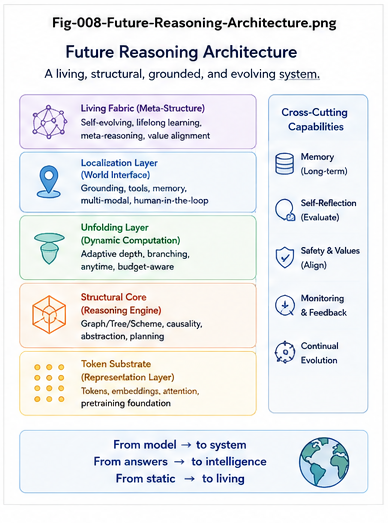

# STAR-008 — Future AI Reasoning Architectures

## From Monolithic LLM Reasoning to Unfolding–Localization Duality, Structural Runtimes, and Living AI

**Repository:** Structural Theory of AI Reasoning  
**Series:** STAR — Structural Theory of AI Reasoning  
**Document:** STAR-008  
**Status:** Future Architecture / Research Agenda

---

## Abstract

The rapid improvement of Large Language Models has demonstrated that substantial reasoning capability can emerge from large-scale learned representations.

However, future AI reasoning architectures need not remain organized around a single monolithic model attempting to perform every reasoning function internally.

The Structural Theory of AI Reasoning developed in this repository suggests a different trajectory.

LLMs can be interpreted as large-scale **Folding structures** whose learned intelligence can be selectively **Unfolded** during inference:

\[
\boxed{
Folded\ Intelligence
\rightarrow
Selective\ Unfolding
}
\]

Structural Intelligence approaches the same reasoning problem from the complementary direction:

\[
\boxed{
Global\ Structural\ Space
\rightarrow
Localization
}
\]

The two processes may converge functionally on a local reasoning region:

\[
\boxed{
R_{LLM}^{Unfold}
\approx
R_{SI}^{Localized}
}
\]

This suggests that future AI systems may increasingly separate reasoning into specialized architectural roles:

\[
\boxed{
Localization
+
Unfolding
+
Per\text{-}Node\ Intelligence
+
Structural\ Traversal
+
Action
+
Validation
+
Persistent\ Growth
}
\]

The result would not be the replacement of LLMs by Structural Intelligence.

Nor would it be the reduction of Structural Intelligence to a wrapper around an LLM.

Instead, future systems may develop a division of reasoning labor in which:

> **Structural Intelligence determines where reasoning should occur.**

> **LLMs and other reasoning engines determine what intelligence can be unfolded there.**

> **Structural Runtime determines what should be validated, preserved, reused, and evolved.**

This paper explores several possible future architectures arising from that division of labor, including:

1. LLM-centered reasoning systems;
2. explicit Structural Localization layers;
3. specialized Unfolding engines;
4. an Unfolding-oriented dual architecture to conventional Transformers;
5. heterogeneous Per-Node intelligence;
6. TaskGraph–Action Calling Graph dual systems;
7. Structural Reasoning Runtimes;
8. living and self-extending reasoning systems;
9. collective reasoning infrastructure.

The central architectural trajectory is:

\[
\boxed{
Monolithic\ Reasoning
\rightarrow
Reasoning\ Division\ of\ Labor
\rightarrow
Structural\ Runtime
\rightarrow
Living\ Intelligence
}
\]

---

---

# 1. The Current Center of Gravity

Contemporary AI reasoning is largely model-centered.

A simplified architecture is:

    Input
      |
      v
    Large Language Model
      |
      v
    Output

With additional reasoning mechanisms:

    Prompt
      |
      v
    LLM
      |
      v
    Internal Multi-Step Reasoning
      |
      v
    Answer

The dominant engineering question is often:

How can the model itself reason better?

This has led to major progress through:

larger models;
better training;
reinforcement learning;
test-time computation;
tool use;
retrieval;
longer contexts;
reasoning traces;
model ensembles.

These developments are important.

But they do not imply that the long-term architecture of AI reasoning must remain monolithic.

# 2. Model Scaling and Architectural Scaling

There are at least two fundamentally different scaling directions.

### Model Scaling
$$ Model_t \rightarrow Larger / Better\ Model_{t+1} $$

This improves the capability contained inside the model.

### Architectural Scaling
$$ Single\ Reasoner \rightarrow Coordinated\ Reasoning\ System $$

This improves how different forms of intelligence are:

- selected;
- localized;
- invoked;
- connected;
- validated;
- preserved.

Thus:

$$ \boxed{ Future\ Reasoning\ Scaling = Model\ Scaling + Architectural\ Scaling } $$

The second dimension may become increasingly important.

# 3. Why Reasoning May Naturally Differentiate

Reasoning contains several distinct functions.

For example:

1. determine the relevant region;
2. select a reasoning mechanism;
3. generate alternatives;
4. score alternatives;
5. traverse dependencies;
6. detect missing structure;
7. bridge gaps;
8. create actions;
9. execute actions;
10. observe results;
11. validate conclusions;
12. preserve reusable structure.

There is no fundamental requirement that all twelve functions be performed by one homogeneous mechanism.

Therefore:

$$ \boxed{ Reasoning \neq One\ Computational\ Operation } $$

Reasoning may naturally differentiate into specialized subsystems.

# 4. The Biological Analogy

Complex biological intelligence does not appear to rely on one perfectly uniform computational operation.

Different structures specialize in different functions while participating in a larger integrated system.

Future AI may follow a similar engineering tendency:

$$ \boxed{ Functional\ Differentiation + Runtime\ Coordination } $$

The important point is not to copy biology literally.

The point is architectural:

> Complex intelligence may benefit from specialized computational structures connected through a common runtime.

# 5. LLMs as Folding Architectures

LLMs can be interpreted structurally as large-scale learned Folding systems.

Training compresses enormous quantities of:

- language;
- patterns;
- concepts;
- relations;
- procedures;
- behavioral regularities;

into distributed model parameters.

Conceptually:

$$ \boxed{ Data + Experience + Structure \rightarrow Folded\ Parameter\ Space } $$

Inference then selectively expresses useful capability from that folded space.

Thus:

$$ \boxed{ Folding \rightarrow Unfolding } $$

provides one useful structural interpretation of LLM reasoning.

# 6. Why Folding Naturally Implies Unfolding

A folded structure is useful because relevant capability can later be recovered or reconstructed.

Therefore:

$$ Folded\ Intelligence $$

naturally creates the engineering problem:

$$ \boxed{ How\ should\ intelligence\ be\ unfolded? } $$

Current Transformers already perform a form of dynamic unfolding during inference.

But future systems may make this function increasingly:

- explicit;
- specialized;
- controllable;
- inspectable;
- structurally addressed.

This suggests an important future direction.

# 7. From Transformer to Explicit Unfolding Architecture

The conventional Transformer is optimized primarily around learned representation and sequence transformation.

A future architecture may explicitly distinguish:

$$ \boxed{ Representation\ / Folding } $$

from:

$$ \boxed{ Reasoning\ / Unfolding } $$

This does not necessarily require replacing the Transformer.

Instead, a future system may add or evolve a complementary computational structure whose primary role is:

> selectively reconstructing, expanding, routing, and organizing reasoning from folded intelligence.

We can call this hypothetical family:

$$ \boxed{ Unfolding\ Architecture } $$

or provisionally:

$$ \boxed{ Unfolding\ Transformer } $$

# 8. The Unfolding Transformer Hypothesis

The hypothesis is not:

> A second Transformer should simply run after the first Transformer.

The deeper proposal is functional specialization.

One subsystem becomes increasingly optimized for:

$$ \boxed{ Folding / Representation / Compression } $$

while another becomes increasingly optimized for:

$$ \boxed{ Unfolding / Expansion / Reasoning\ Organization } $$

Thus:

$$ \boxed{ Folding\ Engine \leftrightarrow Unfolding\ Engine } $$

may emerge as a future division of labor.

# 9. Why an Unfolding Architecture Could Be Useful

An explicit Unfolding architecture could potentially control:

- reasoning breadth;
- reasoning depth;
- branch generation;
- hypothesis competition;
- structural expansion;
- retrieval from folded representations;
- reasoning budget;
- stopping conditions;
- interaction with explicit graphs;
- structural delta generation.

Instead of merely producing the next representation:

$$ h_t \rightarrow h_{t+1} $$

the system may explicitly manage:

$$ \boxed{ Reasoning\ Expansion\ Structure } $$

This would make Unfolding itself an architectural object.

# 10. Unfolding Need Not Be Token-Centric

Current LLM reasoning is strongly mediated by token sequences.

Future Unfolding may operate over richer objects:

$$ Tokens $$ $$ Concepts $$ $$ Nodes $$ $$ CCCs $$ $$ Tasks $$ $$ Graphs $$ $$ Runtime\ Invariants $$ $$ Typed\ Structural\ Objects $$

Thus:

$$ \boxed{ Token\ Unfolding \rightarrow Structural\ Unfolding } $$

may become an important research direction.

# 11. Structural Intelligence Approaches from the Other Direction

Structural Intelligence begins not with a folded latent space, but with explicit structure.

It may contain:

- Differential Trees;
- Classification Trees;
- Action Trees;
- Calling Graphs;
- TaskGraphs;
- Action Calling Graphs;
- CCCs;
- Runtime Invariants;
- typed structural objects.

The central reasoning operation is often:

$$ \boxed{ Localization } $$

That is:

> Where in the intelligence structure does the current problem belong?

# 12. Localization as a First-Class Architecture

Instead of requiring a reasoning engine to discover the relevant region entirely internally:

$$ Goal \rightarrow Model \rightarrow Internal\ Search $$

a Structural Localization layer can perform:

$$ Goal + Context + StructuralSpace \rightarrow ReasoningRegion $$

Then:

$$ ReasoningRegion \rightarrow Reasoner $$

Thus:

$$ \boxed{ Localization \rightarrow Reasoning } $$

becomes an explicit architectural boundary.

# 13. The Structural Handshake

The previous paper introduced:

$$ \boxed{ R_{LLM}^{Unfold} \approx R_{SI}^{Localized} } $$

The two reasoning processes approach from opposite directions:

      LLM / FOLDED SIDE

     Folded Intelligence
             |
             v
         Unfolding
             |
             v
      +--------------+
      | LOCAL        |
      | REASONING    |
      | REGION       |
      +--------------+
             ^
             |
        Localization
             ^
             |
     Structural Space

      STRUCTURAL SIDE

This is the fundamental handshake around which future reasoning architectures may be organized.

# 14. The Future Reasoning Interface

A future system may expose an interface conceptually similar to:

    ReasoningRegion localize(
        Goal goal,
        Context context,
        StructuralState state
    )

followed by:

    CandidateDelta unfold(
        ReasoningRegion region,
        ReasoningPolicy policy
    )

followed by:

    ValidatedDelta validate(
        CandidateDelta candidate,
        StructuralState core
    )

followed by:

    StructuralState preserve(
        StructuralState core,
        ValidatedDelta delta
    )

The canonical runtime becomes:

$$ \boxed{ LOCALIZE \rightarrow UNFOLD \rightarrow VALIDATE \rightarrow PRESERVE } $$

# 15. Architecture A — LLM-Centered Reasoning

The first architecture remains close to current systems.

    Prompt
      |
      v
    LLM
      |
      +--> Retrieval
      |
      +--> Tools
      |
      +--> Search
      |
      v
    Answer

The LLM remains the central controller.

This architecture has major advantages:

- simplicity;
- flexibility;
- broad generality;
- rapid engineering;
- strong language interface.

It will likely remain important.

# 16. Limitation of the LLM-Centered Architecture

The model must internally or semi-internally perform:

- localization;
- planning;
- routing;
- reasoning;
- tool selection;
- memory interpretation;
- validation;
- output generation.

This creates:

$$ \boxed{ Reasoning\ Function\ Concentration } $$

As systems become more complex, explicit division of labor may become increasingly attractive.

# 17. Architecture B — LLM + Structural Localization

The next architecture introduces an explicit localizer.

    Goal / Prompt
         |
         v
    Structural Localizer
         |
         v
    Reasoning Region
         |
         v
    LLM
         |
         v
    Answer / Candidate Delta

This changes the LLM's task from:

> Find where to reason and reason there.

to:

> Here is the relevant structural region. Reason here.

Thus:

$$ \boxed{ Localization \rightarrow LLM } $$

reduces one burden on the model.

# 18. Architecture C — Localization + Multiple Reasoners

Once Localization becomes explicit, the system need not always call the same model.

                Goal
                 |
                 v
         Structural Localizer
                 |
                 v
          Reasoning Router
        /       |       \
       v        v        v
     LLM      Solver   Specialist
       \        |        /
        \       |       /
         Candidate Delta

Thus:

$$ \boxed{ Localization \rightarrow Reasoner\ Selection } $$

becomes possible.

This supports heterogeneous intelligence.

# 19. Per-Node Intelligence

Different nodes may use different reasoning mechanisms.

For example:

$$ Node_A \rightarrow Branching + Scoring $$ $$ Node_B \rightarrow Boolean\ Rules $$ $$ Node_C \rightarrow CCC $$ $$ Node_D \rightarrow LLM $$ $$ Node_E \rightarrow Solver $$ $$ Node_F \rightarrow Human $$

Therefore:

$$ \boxed{ Intelligence = Composition\ of\ Heterogeneous\ Per\text{-}Node\ Intelligence } $$

This is a major Structural Intelligence principle.

# 20. The Future Is Not Necessarily LLM Everywhere

Once reasoning is structurally localized, some nodes may not need an LLM at all.

A deterministic rule may be:

- cheaper;
- faster;
- safer;
- more auditable.

A numerical solver may outperform language reasoning.

A specialized model may outperform a general LLM.

Thus:

$$ \boxed{ Best\ Reasoner = f(Node,Context,Goal,Policy) } $$

rather than:

$$ Best\ Reasoner = LLM\ Everywhere $$

# 21. LLM as a High-Level Reasoning Engine

This does not diminish the role of LLMs.

LLMs may remain especially strong at:

- broad synthesis;
- semantic transformation;
- abstraction;
- hypothesis generation;
- analogy;
- explanation;
- bridge generation;
- forward extension;
- structural proposal.

Thus future systems may increasingly use LLMs where:

$$ \boxed{ High\ Semantic\ Flexibility } $$

is valuable.

Other mechanisms can handle more rigid local operations.

# 22. Architecture D — Folding Core + Unfolding Engine

A more radical architecture separates folded capability from reasoning expansion.

              FOLDED CORE
                  |
                  v
          Unfolding Engine
                  |
                  v
        Candidate Reasoning
                  |
                  v
         Structural Output

The Folded Core contains compressed learned intelligence.

The Unfolding Engine controls how that intelligence becomes explicit reasoning.

Thus:

$$ \boxed{ Folded\ Core + Unfolding\ Engine } $$

becomes a new model-level architecture.

# 23. Architecture E — Localization + Unfolding Dual System

The previous two directions can be combined:

             Structural Space
                    |
                    v
                Localize
                    |
                    v
             Reasoning Region
                    |
                    v
              Unfolding Engine
                    |
                    v
             Candidate Delta

The key equation is:

$$ \boxed{ Localization \rightarrow Unfolding } $$

This is one of the strongest candidate architectures suggested by this theory.

# 24. The Two-Sided Search

Localization and Unfolding can be understood as two-sided search.

Localization asks:

$$ Global\ Structure \rightarrow Where? $$

Unfolding asks:

$$ Folded\ Intelligence \rightarrow What? $$

They meet at:

$$ Local\ Reasoning\ Region $$

Thus:

$$ \boxed{ Where + What \rightarrow Reasoning } $$

This division can make reasoning more controllable.

# 25. Architecture F — Bidirectional Localization–Unfolding

The handshake should not be strictly one-way.

    Structural Localizer
           |
           v
     Proposed Region
           |
           v
    Unfolding Engine
           |
           +---- Localization Challenge
           |
           v
     Refined Region
           |
           v
        Reasoning

The Unfolding engine may discover:

> The current localization is wrong.

Therefore:

$$ \boxed{ Localization \leftrightarrow Unfolding } $$

is preferable to rigid:

$$ Localization \rightarrow Unfolding $$

# 26. Architecture G — Tree Localization + Graph Reasoning

Different structural forms can specialize.

Trees are naturally useful for:

$$ Localization $$

Graphs are naturally useful for:

$$ Relation + Dependency + Traversal + Extension $$

Thus:

    Goal
     |
     v
    Differential / Classification Tree
     |
     v
    Localized Region
     |
     v
    Calling Graph
     |
     v
    Reasoning / Traversal / Gap Detection

This creates:

$$ \boxed{ Tree \rightarrow Graph } $$

as a powerful reasoning pattern.

# 27. Why Trees and Graphs Are Complementary

A tree asks:

> Which region?

A graph asks:

> How are the relevant objects connected?

Therefore:

$$ \boxed{ Tree = Localization\ Structure } $$

and:

$$ \boxed{ Graph = Relational\ Reasoning\ Structure } $$

The two should not be forced into one representation.

Structural specialization is an advantage.

# 28. Architecture H — Calling Graph Reasoning

Calling Graphs can represent:

- dependencies;
- causal or procedural relations;
- computational paths;
- executable relations;
- missing transitions.

A reasoning process can therefore operate as:

$$ CG_t \rightarrow Traverse \rightarrow DetectGap \rightarrow Bridge \rightarrow CG_{t+1} $$

Thus:

$$ \boxed{ CallingGraph = Reasoning\ Surface } $$

rather than merely a visualization.

# 29. Gap Bridging as a Native Reasoning Operation

A future reasoning runtime may expose:

    BridgeCandidate bridge(
        StructuralGap gap,
        LocalContext context,
        ReasoningPolicy policy
    )

The reasoning engine no longer receives only a generic prompt.

It receives:

$$ \boxed{ A\ Structurally\ Typed\ Gap } $$

This makes reasoning more addressable.

# 30. Forward Extension as a Native Reasoning Operation

Likewise:

    ExtensionCandidate extend(
        StructuralFrontier frontier,
        Goal goal,
        ReasoningPolicy policy
    )

This asks:

> What valuable structure could exist beyond the current frontier?

Thus:

$$ \boxed{ Bridge() } $$

and:

$$ \boxed{ Extend() } $$

may become fundamental reasoning runtime operations.

# 31. Architecture I — TaskGraph Reasoning

For higher-level reasoning:

$$ Goal \rightarrow TaskGraph $$

The TaskGraph represents:

$$ What\ needs\ to\ be\ solved $$

Reasoning can:

- create tasks;
- decompose tasks;
- identify dependencies;
- detect missing tasks;
- reprioritize;
- close tasks.

Thus:

$$ \boxed{ TaskGraph = Explicit\ Reasoning\ Agenda } $$

# 32. Architecture J — Action Calling Graph

The Action Calling Graph represents:

$$ How\ tasks\ can\ be\ executed $$

Thus:

$$ TaskGraph \rightarrow ActionCG $$

provides a bridge from reasoning to action.

The ActionCG can include:

- tools;
- APIs;
- programs;
- workflows;
- human actions;
- AI actions.

This gives reasoning an executable substrate.

# 33. TaskGraph–ActionCG Dual Architecture

The dual system becomes:

               GOAL
                |
                v
            TaskGraph
                |
        What must be done?
                |
                v
         Action Calling Graph
                |
        How can it be done?
                |
                v
             ACTION
                |
                v
             RESULT
                |
                v
            TaskGraph

Thus:

$$ \boxed{ TaskGraph \leftrightarrow ActionCG } $$

forms a reasoning–execution loop.

# 34. Core-Preserved Coding as an Extension Mechanism

Suppose the ActionCG encounters:

$$ CapabilityGap $$

The system may invoke:

$$ Core\text{-}Preserved\ Coding $$

to generate a new executable extension.

Then:

$$ CodeCore_t \rightarrow CodeCore_{t+1} $$

which expands:

$$ ActionCG_t \rightarrow ActionCG_{t+1} $$

Therefore:

$$ \boxed{ Reasoning \rightarrow Capability\ Gap \rightarrow Coding \rightarrow New\ Reasoning\ Capability } $$

This creates a powerful self-extension pathway.

# 35. AI Coding and AI Reasoning Become Dual Growth Processes

The two processes are:

### Coding Growth
$$ CodeGap \rightarrow GeneratedExtension \rightarrow Validation \rightarrow CodeGrowth $$

### Reasoning Growth
$$ StructuralGap \rightarrow ReasonedExtension \rightarrow Validation \rightarrow KnowledgeGrowth $$

Thus:

$$ \boxed{ Core\text{-}Preserved\ Coding \leftrightarrow Core\text{-}Preserved\ Reasoning } $$

Future AI systems may coordinate both through the same structural runtime.

# 36. Architecture K — Structural Reasoning Runtime

The previous components suggest a new system layer:

$$ \boxed{ Structural\ Reasoning\ Runtime } $$

Its responsibilities include:

- structural state;
- localization;
- reasoning routing;
- Per-Node intelligence;
- graph traversal;
- Gap detection;
- Gap Bridging;
- Forward Extension;
- TaskGraph management;
- ActionCG management;
- validation;
- structural promotion;
- Runtime Invariants;
-audit.

This is substantially more than an LLM wrapper.

# 37. The Runtime Becomes the Integration Layer

A future architecture may look like:

                        HUMAN / ENVIRONMENT
                               |
                               v
                    STRUCTURAL RUNTIME
                               |
           +-------------------+-------------------+
           |                   |                   |
           v                   v                   v
       Localizer          Policy Engine       Gap Detector
           |                                       |
           +-------------------+-------------------+
                               |
                               v
                        Reasoning Router
                  /            |             \
                 v             v              v
               LLM          Solver        Specialist AI
                  \            |             /
                   \           |            /
                        Candidate Delta
                               |
                               v
                           Validator
                               |
                               v
                      Structural State
                               |
                               v
                           TaskGraph
                               |
                               v
                           ActionCG
                               |
                               v
                            ACTION

This is a system-level reasoning architecture.

# 38. Structural Runtime vs Agent Loop

A conventional agent loop may be:

$$ Observe \rightarrow Think \rightarrow Act \rightarrow Observe $$

A Structural Runtime adds explicit persistent reasoning objects:

$$ Observe \rightarrow Localize \rightarrow StructuralReason \rightarrow TaskGraph \rightarrow ActionCG \rightarrow Act $$

then:

$$ Result \rightarrow Validate \rightarrow StructuralGrowth $$

Thus:

$$ \boxed{ Agent\ Loop + Persistent\ Structural\ Intelligence = Structural\ Reasoning\ Runtime } $$

# 39. Architecture L — Runtime Invariant Protected Reasoning

Future autonomous reasoning requires boundaries.

Let:

$$ RI $$

represent Runtime Invariants.

Before a candidate structural change is promoted:

$$ Validate(\Delta S) $$

then:

$$ CheckRI(S_t+\Delta S) $$

Only if:

$$ CheckRI=True $$

does:

$$ S_t \rightarrow S_{t+1} $$

occur.

Thus:

$$ \boxed{ Reasoning + Growth + Invariant\ Preservation } $$

provides a path toward governed autonomy.

# 40. Runtime Invariants as Certified Building Blocks

If reasoning structures can themselves become certified:

$$ RI_1,RI_2,\ldots,RI_n $$

then future systems may reason through combinations of trusted structural units.

This changes the engineering problem from:

$$ Generate\ Everything $$

to:

$$ \boxed{ Reuse + Compose + Extend } $$

This could substantially reduce reasoning cost and risk.

# 41. Architecture M — Structural Memory

Future AI memory may become less document-centric and more structurally typed.

Instead of storing only:

$$ Text $$

the system can preserve:

- nodes;
- edges;
- CCCs;
- decisions;
- tasks;
- gaps;
- evidence;
- invariants;
- validated bridges.

Thus:

$$ \boxed{ Memory \rightarrow Operational\ Structural\ Memory } $$

The stored object can directly participate in reasoning.

# 42. Structural Memory and Retrieval

Traditional retrieval asks:

> Which document is relevant?

Structural retrieval can ask:

> Which node, edge, task, CCC, or graph neighborhood is relevant?

Thus:

$$ DocumentRetrieval \rightarrow StructuralLocalization $$

may improve reasoning precision.

The future of retrieval may therefore increasingly overlap with Structural Intelligence.

# 43. Architecture N — Living Reasoning

STAR-007 introduced:

$$ \boxed{ The\ Living\ Reasoning\ Loop } $$

Its defining property is:

$$ S_t \rightarrow Reasoning_t \rightarrow \Delta S_t \rightarrow S_{t+1} $$

followed by:

$$ S_{t+1} \rightarrow Reasoning_{t+1} $$

Reasoning changes the structure from which future reasoning begins.

# 44. From Prompt-Driven to Gap-Driven AI

A major architectural transition is:

$$ Prompt \rightarrow Reasoning $$

becoming:

$$ Gap \rightarrow Reasoning $$

The structural system itself detects:

$$ Something\ is\ missing $$

and creates a reasoning task.

Thus:

$$ \boxed{ External\ Prompt \rightarrow Internal\ Structural\ Trigger } $$

is a major step toward autonomy.

# 45. From Gap-Driven to Opportunity-Driven AI

An even more advanced system can identify:

$$ Opportunity $$

rather than only:

$$ Gap $$

Then:

$$ Opportunity \rightarrow ForwardExtension $$

This creates proactive intelligence.

The progression is:

$$ \boxed{ Prompt\text{-}Driven \rightarrow Gap\text{-}Driven \rightarrow Opportunity\text{-}Driven } $$

# 46. Architecture O — Self-Extending Structural AI

Combining these mechanisms gives:

    Structural State
          |
          v
    Gap / Opportunity Detection
          |
          v
    Localization
          |
          v
    Reasoning / Unfolding
          |
          v
    Candidate Extension
          |
          v
    Validation
          |
          v
    Structural Growth
          |
          v
    Capability Growth
          |
          +-------------------->

This is:

$$ \boxed{ Self\text{-}Extending\ Structural\ AI } $$

subject to governance and invariants.

# 47. Architecture P — Meta-Reasoning Runtime

A sufficiently mature system may detect not only domain gaps, but reasoning-system gaps.

For example:

$$ LocalizationFailure $$ $$ RepeatedBridgeFailure $$ $$ PolicyConflict $$ $$ ReasoningCostExplosion $$

These can become:

$$ MetaGap $$

Then:

$$ MetaGap \rightarrow MetaReasoning \rightarrow ReasoningArchitectureDelta $$

Thus the system can improve how it reasons.

# 48. Reasoning About Reasoning

Meta-reasoning creates:

$$ \boxed{ Reasoning \rightarrow Evaluation \rightarrow ReasoningStructureChange \rightarrow BetterReasoning } $$

This is structurally different from merely solving another domain problem.

The object being modified is the reasoning architecture itself.

This should require stronger governance.

# 49. Architecture Q — Multi-Brain AI Units

A future system may contain specialized AI units:

$$ BrainUnit_{science} $$ $$ BrainUnit_{code} $$ $$ BrainUnit_{law} $$ $$ BrainUnit_{planning} $$ $$ BrainUnit_{control} $$

Each may accumulate specialized:

$$ Function\ Tunnel\ Capital $$

The Structural Runtime can localize and dispatch problems among them.

Thus:

$$ \boxed{ Localization \rightarrow Specialized\ Brain\ Unit } $$

provides another form of reasoning division of labor.

# 50. Multi-Brain Systems Need Structural Coordination

Without explicit coordination:

$$ Many\ Models $$

can become:

$$ Many\ Uncoordinated\ Outputs $$

Structural Intelligence provides shared:

- addresses;
- TaskGraphs;
- Calling Graphs;
- CCCs;
- policies;
- invariants.

Thus:

$$ \boxed{ Multi\text{-}Brain + Structural\ Runtime } $$

is more important than simply adding more models.

# 51. Architecture R — Collective Reasoning Infrastructure

The same architecture can extend beyond one AI system.

Humans and AIs can contribute:

$$ Candidate\ Structural\ Deltas $$

to a shared:

$$ Structural\ Knowledge\ Infrastructure $$

After validation:

$$ Candidate \rightarrow Shared\ Structural\ Capital $$

Future humans and AIs can reuse it.

Thus:

$$ \boxed{ Reasoning \rightarrow Collective\ Learning } $$

# 52. Collective Learning Changes the Unit of Progress

If every reasoning process remains private:

$$ Reasoner_i \rightarrow PrivateAnswer_i $$

progress is repeatedly reconstructed.

If useful reasoning becomes shared structural capital:

$$ Reasoner_i \rightarrow ValidatedDelta \rightarrow SharedStructure $$

then:

$$ Reasoner_j $$

can begin from the improved structure.

Thus:

$$ \boxed{ Individual\ Reasoning \rightarrow Collective\ Structural\ Accumulation } $$

may become a major future intelligence mechanism.

# 53. Future Reasoning May Be Infrastructure-Centric

Today the central artifact is often:

$$ Model $$

In future systems, equally important artifacts may include:

$$ Structural\ Runtime $$ $$ TaskGraph $$ $$ ActionCG $$ $$ Certified\ RI\ Library $$ $$ CCC\ Library $$ $$ Structural\ Memory $$ $$ Reasoning\ Router $$ $$ Validation\ Infrastructure $$

Thus:

$$ \boxed{ Model\text{-}Centric\ AI \rightarrow Intelligence\ Infrastructure } $$

may be a major architectural transition.

54. A Possible Future AI Reasoning Stack

A future stack could be:
    
    +--------------------------------------------------+
    |              GOALS / HUMAN / ENVIRONMENT         |
    +--------------------------------------------------+
                             |
                             v
    +--------------------------------------------------+
    |        GAP / OPPORTUNITY / EVENT DETECTION       |
    +--------------------------------------------------+
                             |
                             v
    +--------------------------------------------------+
    |          STRUCTURAL LOCALIZATION LAYER           |
    |  Differential Tree / Classification / Routing    |
    +--------------------------------------------------+
                             |
                             v
    +--------------------------------------------------+
    |              REASONING CONTROL LAYER             |
    |     CCC / Policy / Budget / Risk / Priority      |
    +--------------------------------------------------+
                             |
                             v
    +--------------------------------------------------+
    |             UNFOLDING / REASONING LAYER          |
    | LLM | Solver | Search | Specialist | Human       |
    +--------------------------------------------------+
                             |
                             v
    +--------------------------------------------------+
    |            STRUCTURAL REASONING LAYER            |
    | Calling Graph | TaskGraph | Gap | Extension      |
    +--------------------------------------------------+
                             |
                             v
    +--------------------------------------------------+
    |               ACTION RUNTIME LAYER               |
    | ActionCG | Tools | APIs | Code | Workflows       |
    +--------------------------------------------------+
                             |
                             v
    +--------------------------------------------------+
    |              VALIDATION / RI LAYER               |
    | Tests | Evidence | Rules | Human | Invariants    |
    +--------------------------------------------------+
                             |
                             v
    +--------------------------------------------------+
    |        STRUCTURAL MEMORY / GROWTH LAYER          |
    | Promote | Preserve | Reuse | Prune | Refold      |
    +--------------------------------------------------+
                             |
                             +-------------------------->

This architecture makes reasoning a coordinated runtime process.

# 55. The LLM–SI Reasoning Map

The distinction can be summarized as follows:

|Reasoning Dimension	|LLM-Centered Reasoning	|Structural Intelligence |
|---|---|---|
|Primary representation	|Folded / distributed	|Explicit / structural
|Characteristic reasoning operation	|Unfolding	|Localization + traversal
|Localization	|Mostly implicit / soft	|Explicit / addressable
|Reasoning unit	|Token / latent state / generated step	|Node / CCC / tree / graph / task
|Branching	|Dynamically generated	|Can be explicit and persistent
|Relations	|Often latent	|Explicit edges / dependencies
|Gap representation	|Usually implicit	|First-class structural object
|Gap Bridging	|Generative	|Addressed + generative + validated
|Forward Extension	|Generative exploration	|Structural frontier extension
|Per-Node intelligence	|Primarily shared model mechanism	|Heterogeneous mechanisms
|Task organization	|Usually dynamically generated	|Persistent TaskGraph
|Action organization	|Tools / agents	|Action Calling Graph
|Validation	|Self / tool / external	|Explicit runtime layer
|Persistence	|Context / memory / retraining	|Structural promotion
|Evolution	|Primarily model or memory updates	|Explicit structural growth
|Explainability	|Behavioral / textual	|Structural + runtime trace
|Governance	|External policies / constraints	|Policy + CCC + RI
|Autonomous trigger	|Prompt / agent loop	|Gap / opportunity / structural event
|Long-term tendency	|Better folded reasoning	|Living structural reasoning |

The important conclusion is not that one column should defeat the other.

It is:

$$ \boxed{ The\ columns\ are\ complementary } $$

# 56. The Convergence Architecture

The future system may combine the strongest features of both columns.

        FOLDED INTELLIGENCE
                |
                v
           UNFOLDING
                |
                |
                v
       LOCAL REASONING REGION
                ^
                |
                |
          LOCALIZATION
                ^
                |
       STRUCTURAL INTELLIGENCE

Then:

        LOCAL REASONING REGION
                |
                v
        Candidate Structural Delta
                |
                v
        Validation
                |
                v
        Persistent Structural Growth
                |
                v
        Future Localization

This is the core convergence architecture.

# 57. The Three-Way Division of Labor

A mature architecture may have three major intelligence roles.

### Structural Intelligence

Determines:

$$ \boxed{ Where? } $$

### Unfolding Intelligence

Determines:

$$ \boxed{ What? } $$

### Structural Runtime

Determines:

$$ \boxed{ What\ Remains? } $$

Thus:

$$ \boxed{ Where \rightarrow What \rightarrow What\ Remains } $$

forms the core reasoning pipeline.

# 58. The Fourth Role — What Next?

Living Reasoning adds:

$$ \boxed{ What\ Next? } $$

This is generated through:

- Gap detection;
- opportunity detection;
- TaskGraph frontier;
- environmental events;
- policy triggers.

Therefore the full architecture asks:

$$ \boxed{ Where? \rightarrow What? \rightarrow What\ Remains? \rightarrow What\ Next? } $$

The fourth question closes the evolutionary loop.

# 59. Reasoning Architecture May Become Cyclic Rather Than Linear

Traditional AI architecture is often drawn:

$$ Input \rightarrow Model \rightarrow Output $$

Future reasoning systems may instead be fundamentally cyclic:

$$ \boxed{ Structure \rightarrow Reason \rightarrow Action \rightarrow Evidence \rightarrow Structure } $$

This is a major conceptual change.

The central object is no longer only the model.

It is the evolving reasoning loop.

# 60. Future Reasoning May Become Event-Driven

A Structural Runtime can respond to:

$$ Prompt $$

but also:

$$ GapDetected $$ $$ InvariantViolation $$ $$ NewEvidence $$ $$ TaskCompleted $$ $$ TaskFailed $$ $$ OpportunityDetected $$

Thus reasoning becomes:

$$ \boxed{ Event\text{-}Driven } $$

rather than purely prompt-driven.

This makes AI reasoning look increasingly like a runtime system.

# 61. Future Reasoning May Become Addressable

Instead of:

    Think about this.

future systems may invoke:

    reason(node=N42)
    
    bridge(gap=G17)
    
    extend(frontier=F8)
    
    validate(delta=D31)
    
    relocalize(task=T9)

Thus:

$$ \boxed{ Reasoning \rightarrow Addressable\ Runtime\ Operation } $$

This is a major engineering advantage of explicit structure.

# 62. Future Reasoning May Become Typed

A reasoning request can carry a type:

$$ KnowledgeGap $$ $$ LogicGap $$ $$ CodeGap $$ $$ ActionGap $$ $$ PolicyGap $$ $$ EvidenceGap $$

Then:

$$ GapType \rightarrow ReasoningStrategy $$

Thus:

$$ \boxed{ Typed\ Reasoning } $$

may replace some generic prompting.

# 63. Future Reasoning May Become Budget-Aware

Structural importance can determine reasoning cost.

Let:

$$ B_i = f( Importance_i, Risk_i, Uncertainty_i, ExpectedValue_i ) $$

Then:

$$ B_i $$

controls:

- model size;
- reasoning depth;
- number of branches;
- number of validators;
- external searches;
- human escalation.

Thus:

$$ \boxed{ Reasoning\ Budget \leftarrow Structural\ Need } $$

becomes a runtime policy.

# 64. Structural Test-Time Scaling

Instead of:

$$ More\ Test\text{-}Time\ Compute $$

everywhere, the system can allocate:

$$ More\ Compute $$

to:

$$ HighValueGap $$

and less to:

$$ LowValueNode $$

Therefore:

$$ \boxed{ Structural\ Test\text{-}Time\ Scaling } $$

means allocating compute according to explicit reasoning structure.

This may become an important efficiency frontier.

# 65. Future Reasoning May Become Auditable

Because reasoning is structurally addressed, the system can record:

    Trigger:
    Gap G17
    
    Localization:
    Task T4 -> Node N22
    
    Reasoner:
    Specialist Model M3
    
    Candidate:
    Delta D11
    
    Validation:
    Test Suite V8
    
    Invariant Check:
    RI-4 PASS
    
    Promotion:
    Accepted
    
    Result:
    S(t) -> S(t+1)

Thus:

$$ \boxed{ Reasoning \rightarrow Runtime\ Audit\ Trail } $$

becomes natural.

# 66. Future Reasoning May Become Reusable

If a validated reasoning structure is preserved:

$$ Reasoning_t \rightarrow ReusableStructure $$

then future problems can invoke:

$$ Reuse $$

rather than:

$$ ReasonFromScratch $$

Thus:

$$ \boxed{ Reasoning\ Output \rightarrow Reasoning\ Infrastructure } $$

This may fundamentally change the economics of inference.

# 67. Future Reasoning May Become Compositional

Validated structural units can be composed:

$$ RI_A + CCC_B + Graph_C + Reasoner_D $$

into:

$$ Solution_E $$

Thus:

$$ \boxed{ Generate\ Everything \rightarrow Compose\ Trusted\ Intelligence } $$

may become an important engineering transition.

# 68. Future Reasoning May Become Evolvable Without Constant Retraining

If:

$$ \theta_{t+1} = \theta_t $$

while:

$$ S_{t+1} \neq S_t $$

the system can still improve operationally.

Thus:

$$ \boxed{ Structural\ Evolution } $$

can provide a fast adaptation channel between expensive parameter updates.

This may be especially important for:

- enterprise AI;
- scientific systems;
- long-running agents;
- personalized systems;
- autonomous machines.

# 69. Future Model Training May Consume Structural Growth

Persistent Structural Intelligence can later become training material.

Thus:

$$ Reasoning \rightarrow ValidatedStructure \rightarrow TrainingData $$

Then:

$$ TrainingData \rightarrow Refolding \rightarrow NewModel $$

This closes:

$$ \boxed{ Model \rightarrow Structure \rightarrow Model } $$

as an evolutionary loop.

# 70. Folding and Unfolding May Become Separate Optimization Targets

Current training often optimizes a model globally.

Future systems may optimize separately for:

### Folding Quality

How effectively can knowledge and capability be compressed?

### Unfolding Quality

How effectively can relevant capability be reconstructed and expanded?

### Localization Quality

How accurately can the relevant reasoning region be selected?

### Validation Quality

How reliably can useful reasoning be separated from error?

Thus:

$$ \boxed{ AI\ Reasoning\ Quality = f(FQ,UQ,LQ,VQ) } $$

This decomposition creates new research targets.

# 71. The Unfolding–Localization Duality

The core duality is:

$$ \boxed{ Unfolding: Inside \rightarrow Outside } $$

versus:

$$ \boxed{ Localization: Outside \rightarrow Inside } $$

Unfolding exposes relevant capability from a compressed intelligence space.

Localization narrows a broad explicit structural space to the relevant region.

They meet in:

$$ \boxed{ Operational\ Reasoning } $$

This duality may become a useful architectural principle independent of any specific implementation.

# 72. A Possible Dual-Transformer Direction

One speculative future architecture could contain:

$$ Transformer_F $$

optimized primarily for:

$$ Folding / Representation $$

and:

$$ Transformer_U $$

optimized primarily for:

$$ Unfolding / Reasoning\ Expansion $$

with:

$$ StructuralLocalizer $$

providing explicit reasoning addresses.

Conceptually:

                  INPUT / EXPERIENCE
                         |
                         v
                FOLDING TRANSFORMER
                         |
                         v
                  FOLDED CORE
                         |
                         |
    Structural Space --> LOCALIZER
                         |
                         v
                 Local Reasoning Region
                         |
                         v
               UNFOLDING TRANSFORMER
                         |
                         v
                  Candidate Delta
                         |
                         v
                    Validator

This is a research hypothesis, not a claim that such an architecture is already established.

# 73. The Dual Transformer Need Not Be Symmetric

The two systems may differ substantially.

The Folding side may optimize:

- compression;
- representation;
- generalization;
- prediction.

The Unfolding side may optimize:

- branch control;
- reasoning trajectories;
- structural reconstruction;
- hypothesis generation;
- local expansion;
- stopping.

Thus:

$$ \boxed{ Dual \neq Mirror\ Copy } $$

The duality is functional, not necessarily architectural symmetry.

# 74. Unfolding Could Become a Family of Engines

There may not be one universal Unfolding Transformer.

Instead:

$$ U_{language} $$ $$ U_{math} $$ $$ U_{code} $$ $$ U_{science} $$ $$ U_{planning} $$

could specialize.

Then:

$$ Localization \rightarrow UnfoldingRouter \rightarrow U_i $$

This would parallel the Structural Intelligence principle of Per-Node specialization.

# 75. The Architecture Converges Toward Function Tunnels

Repeated reasoning over a domain may stabilize into:

$$ FunctionTunnel $$

A Function Tunnel represents a mature route through a recurring reasoning or action problem.

Thus:

$$ ExploratoryReasoning \rightarrow RepeatedStructure \rightarrow StableTunnel $$

The system can increasingly replace expensive repeated reasoning with:

$$ \boxed{ Tunnel\ Reuse } $$

This is another mechanism for cumulative efficiency.

# 76. Reasoning Creates Function Tunnel Capital

Successful repeated reasoning can accumulate:

$$ FTC = Function\ Tunnel\ Capital $$

A specialized AI unit with high FTC in a domain can reason more efficiently there.

Thus future reasoning systems may optimize not only:

$$ ParameterCount $$

but also:

$$ \boxed{ Function\ Tunnel\ Capital } $$

This provides a structural interpretation of specialization.

# 77. Future AI May Be a Society of Specialized Reasoning Units

A mature architecture may resemble:

                     STRUCTURAL RUNTIME
                            |
            +---------------+---------------+
            |               |               |
            v               v               v
       Science Unit      Code Unit      Planning Unit
            |               |               |
            v               v               v
          FTNs            FTNs            FTNs
            \               |               /
             \              |              /
                Shared Structural State

The runtime coordinates specialized reasoning capital.

This is substantially different from one universal model doing everything.

# 78. The Role of the General LLM

Even in such a system, a general LLM may remain essential as:

- universal language interface;
- general semantic reasoner;
- translator between structures;
- fallback reasoner;
- cross-domain synthesizer;
- new-domain bootstrap mechanism.

Thus:

$$ \boxed{ General\ LLM + Specialized\ Structural\ Intelligence } $$

may be more realistic than either extreme alone.

# 79. Structural Intelligence as the Coordination Plane

In such systems, Structural Intelligence can act as:

$$ \boxed{ Coordination\ Plane } $$

It does not need to solve every node itself.

Instead, it coordinates:

- localization;
- routing;
- dependency;
- task structure;
- actions;
- validation;
- persistence.

This resembles the distinction between:

$$ Computation $$

and:

$$ Control $$

in many mature engineering systems.

# 80. Reasoning Control Plane and Reasoning Data Plane

A useful future distinction may be:

### Reasoning Control Plane

Responsible for:

- localization;
- policy;
- routing;
- budgets;
- priorities;
- validation requirements.

### Reasoning Data Plane

Responsible for:

- actual LLM inference;
- solving;
- searching;
- executing;
- transforming.

Thus:

$$ \boxed{ Control\ Plane \leftrightarrow Reasoning\ Data\ Plane } $$

could become an important architectural separation.

# 81. Structural Runtime as the Control Plane

Structural Intelligence naturally provides much of the control plane.

LLMs and specialized engines naturally provide much of the reasoning data plane.

Therefore:

$$ \boxed{ Structural\ Runtime \leftrightarrow Reasoning\ Engines } $$

may become a foundational architecture.

This is another expression of:

$$ Localization \leftrightarrow Unfolding $$

at system scale.

# 82. The Architecture Is Not Fixed

The future is unlikely to contain one final universal reasoning architecture.

Different domains may use different combinations.

For example:

### Conversational AI
$$ LLM\text{-}Heavy $$

### Safety-Critical Control
$$ Structure\text{-}Heavy $$

### Scientific Discovery
$$ LLM + Solver + Graph + Experiment $$

### AI Coding
$$ LLM + CallingGraph + Tests + RuntimeInvariants $$

### Autonomous Operations
$$ TaskGraph + ActionCG + Policy + Specialists $$

Thus:

$$ \boxed{ Reasoning\ Architecture = Domain\text{-}Dependent } $$

# 83. A Future Architectural Spectrum

Rather than one architecture, there may be a spectrum:

MODEL-CENTRIC                                      STRUCTURE-CENTRIC

    LLM
     |
    LLM + Tools
     |
    LLM + Retrieval
     |
    LLM + Structural Localization
     |
    Localization + Multiple Reasoners
     |
    Structural Runtime + LLM
     |
    Structural Runtime + Specialized Brain Units
     |
    Living Structural Intelligence
     |
    Collective Structural Intelligence

The likely future is not necessarily movement completely to the right.

It may be dynamic placement along this spectrum according to task requirements.

# 84. The Architectural Selection Principle

A useful principle is:

> **Use the least structural machinery that reliably solves the problem, and introduce explicit structure where persistence, control, reuse, auditability, specialization, or autonomous growth justify it.**

Thus:

$$ \boxed{ Structure \ should\ be\ earned } $$

not added merely for architectural elegance.

This keeps the theory engineering-oriented.

# 85. What LLMs Are Likely to Remain Best At

Even under strong structural architectures, LLMs may remain difficult to replace for:

- ambiguous language;
- open-domain semantic interpretation;
- creative hypothesis generation;
- cross-domain analogy;
- flexible explanation;
- bootstrapping unknown structural regions.

Thus future Structural Intelligence should exploit LLM strengths rather than attempt to reproduce them unnecessarily.

# 86. What Explicit Structure Is Likely to Remain Best At

Explicit structure has natural advantages in:

- addressability;
- persistent dependencies;
- graph traversal;
- localization;
- auditability;
- policy enforcement;
- structural gap detection;
- reuse;
- versioning;
- certified composition.

Thus:

$$ \boxed{ LLM\ Strength + Structural\ Strength } $$

is the more important research target.

# 87. The Architecture Should Preserve Complementarity

A bad hybrid architecture may force:

$$ LLM \rightarrow Rigid\ Symbolic\ System $$

or:

$$ Structure \rightarrow Unstructured\ Text\ Blob $$

A better architecture preserves the native strengths of each side.

Therefore:

$$ \boxed{ Integration \neq Homogenization } $$

The objective is coordinated specialization.

88. Research Program: Localization

Important questions include:

- How should structural reasoning regions be represented?
- How should Localization confidence be measured?
- When should localization broaden or narrow?
- How should an LLM challenge incorrect localization?
- How should trees, graphs, and embeddings cooperate?
- Can Localization quality predict reasoning success?

This can become an independent research field.

# 89. Research Program: Unfolding

Important questions include:

- What exactly constitutes Unfolding?
- Can Unfolding depth be measured?
- Can Unfolding breadth be explicitly controlled?
- Can models be trained specifically for Unfolding?
- Can Unfolding operate over structural objects rather than tokens?
- Should Folding and Unfolding be separate models?

This is a major open direction.

# 90. Research Program: Unfolding–Localization Alignment

A particularly important problem is:

$$ \boxed{ Alignment( R_{LLM}^{Unfold}, R_{SI}^{Localized} ) } $$

Questions include:

- Did both processes identify the same problem?
- Did Unfolding escape the localized region?
- Was the localized region too narrow?
- Did the LLM discover a better region?
- Can alignment be measured automatically?

This could become a practical reasoning benchmark.

# 91. Research Program: Structural Delta

Future systems need reliable transformation:

$$ NaturalLanguageReasoning \rightarrow StructuralDelta $$

Research questions include:

- extraction accuracy;
- typing;
- relation identification;
- evidence attachment;
- confidence;
- contradiction detection;
- provenance.

Without reliable Structural Delta extraction, Living Reasoning remains difficult.

# 92. Research Program: Validation

A future reasoning architecture requires validators as seriously as it requires generators.

Possible validators include:

$$ Rules $$ $$ Tests $$ $$ Solvers $$ $$ ExternalEvidence $$ $$ IndependentModels $$ $$ Humans $$ $$ RuntimeInvariants $$

Thus:

$$ \boxed{ Generation + Validation } $$

should become a first-class architectural pair.

# 93. Research Program: Structural Persistence

Important questions include:

- What should be preserved?
- At what granularity?
- For how long?
- Under which confidence?
- How should contradictions be handled?
- When should structure decay?
- When should structures be refolded?

This is not merely a memory problem.

It is:

$$ \boxed{ Intelligence\ Lifecycle\ Management } $$

# 94. Research Program: Living Reasoning

Living Reasoning raises questions about:

- autonomous triggers;
- gap prioritization;
- opportunity detection;
- stopping;
- resource control;
- self-maintenance;
- meta-reasoning;
- structural debt.

A mature system must balance:

$$ Growth $$

with:

$$ Stability $$

# 95. Research Program: Structural Autonomy

Autonomy can be decomposed into measurable capabilities:

$$ Detect $$ $$ Prioritize $$ $$ Localize $$ $$ Reason $$ $$ Act $$ $$ Validate $$ $$ Preserve $$ $$ Extend $$ $$ MetaReason $$

This is preferable to treating autonomy as one vague scalar.

# 96. Research Program: Collective Learning

A future Collective Learning system must answer:

- How are structural contributions proposed?
- How are they validated?
- How is provenance preserved?
- How are conflicting structures represented?
- How are contributions reused?
- How is malicious or low-quality growth rejected?
- How are humans and AIs jointly credited?

Thus:

$$ \boxed{ Collective\ Learning } $$

requires structural governance as much as intelligence.

# 97. Experimental Architecture 1 — Localize Before Reason

A minimal experiment can compare:

### Baseline
$$ Prompt \rightarrow LLM $$

### Structural
$$ Prompt \rightarrow TreeLocalization \rightarrow LLM $$

Measure:

- accuracy;
- token cost;
- reasoning time;
- irrelevant branches;
- failure localization.

This directly tests whether explicit Localization improves reasoning.

# 98. Experimental Architecture 2 — Gap-Addressed Reasoning

Compare:

### Generic
    Find the problem and fix it.

with:

### Structural
    Gap ID: G17
    Type: dependency gap
    Location: B -> ?
    Expected target: D
    Constraints: C1, C2

Measure:

$$ BridgeAccuracy $$ $$ ReasoningCost $$ $$ ValidationRate $$

This tests addressable reasoning.

# 99. Experimental Architecture 3 — LLM vs Heterogeneous Per-Node Intelligence

Compare:

$$ LLM\ Everywhere $$

with:

$$ Rule + Solver + LLM + CCC $$

selected per node.

Measure:

- accuracy;
- latency;
- cost;
- determinism;
- explainability.

This tests reasoning division of labor.

# 100. Experimental Architecture 4 — Unfolding Breadth Control

Given the same localized region, vary:

$$ Breadth_U $$

and:

$$ Depth_U $$

Measure:

- solution quality;
- compute;
- hallucination;
- useful structural delta.

This can begin operationalizing the Unfolding concept.

# 101. Experimental Architecture 5 — Living Reasoning

Start with:

$$ S_0 $$

Run repeated tasks.

Allow one system to preserve validated Structural Deltas:

$$ S_0 \rightarrow S_1 \rightarrow ... \rightarrow S_n $$

Keep another system structurally static.

Compare later-task performance.

This directly tests:

$$ \boxed{ Does\ Structural\ Growth improve\ future\ reasoning? } $$

# 102. Experimental Architecture 6 — Gap-Driven Autonomy

Provide a structural system containing known gaps.

Do not provide direct prompts for each gap.

Measure whether the system can:

1. detect;
2. prioritize;
3. localize;
4. reason;
5. validate;
6. close;

the gaps.

This tests the transition:

$$ Prompt\text{-}Driven \rightarrow Gap\text{-}Driven $$

# 103. Experimental Architecture 7 — Opportunity-Driven Extension

Provide a complete but extensible structure.

Ask the system to identify:

$$ HighValueOpportunity $$

without a predefined missing edge.

Measure:

- novelty;
- usefulness;
- structural validity;
- validation success;
- future reuse.

This begins testing Forward Extension.

# 104. Experimental Architecture 8 — Dual Folding / Unfolding

A longer-term experiment could compare:

$$ SingleModel $$

with:

$$ FoldedCore + SpecializedUnfoldingEngine $$

The Unfolding engine could be trained or optimized specifically for:

- branch management;
- structural reconstruction;
- localized reasoning;
- candidate delta generation.

This would test whether reasoning specialization creates benefits beyond ordinary inference scaling.

# 105. Architecture Evolution Path

A plausible engineering progression is:

### Stage 1
$$ LLM $$

### Stage 2
$$ LLM + Tools $$

### Stage 3
$$ LLM + Memory + Retrieval $$

### Stage 4
$$ LLM + ExplicitLocalization $$

### Stage 5
$$ Localization + HeterogeneousReasoners $$

### Stage 6
$$ StructuralRuntime $$

### Stage 7
$$ TaskGraph + ActionCG + Growth $$

### Stage 8
$$ LivingReasoning $$

### Stage 9
$$ MultiBrainStructuralAI $$

### Stage 10
$$ CollectiveStructuralIntelligence $$

This is not a prediction that every system must follow these stages.

It is a structural roadmap.

# 106. The Most Important Near-Term Transition

The most practical near-term transition may not be a completely new model architecture.

It may simply be:

$$ \boxed{ Reasoning\ Localization becomes\ explicit. } $$

Once this occurs, many later developments become easier:

- routing;
- specialization;
- budget control;
- Gap addressing;
- structural validation;
- persistent growth.

Therefore explicit Localization may be one of the highest-leverage engineering steps.

# 107. The Most Important Model-Level Research Direction

At the model level, one particularly interesting question is:

> Can Unfolding become an explicit optimization target?

If so, future systems may begin separating:

$$ \boxed{ Capability\ Storage } $$

from:

$$ \boxed{ Capability\ Deployment } $$

more deliberately.

The hypothetical Unfolding Transformer is one possible expression of that direction.

# 108. The Most Important Runtime-Level Research Direction

At runtime level, the central problem is:

$$ \boxed{ How\ do\ we\ turn\ reasoning into\ validated\ persistent\ structural\ growth? } $$

This requires:

$$ Localization + StructuralDelta + Validation + Promotion + Reuse $$

Without this loop, reasoning remains largely episodic.

# 109. The Most Important Autonomy-Level Research Direction

At autonomy level, the key transition is:

$$ \boxed{ Who\ generates\ the\ next\ reasoning\ task? } $$

If the answer is always:

$$ Human $$

the system remains fundamentally prompt-driven.

If:

$$ StructuralGap $$

or:

$$ StructuralOpportunity $$

can generate the next task, a new class of AI runtime becomes possible.

# 110. The Most Important Safety-Level Research Direction

The central question is not simply:

> How do we stop autonomous reasoning?

A more useful question is:

> How do we make autonomous structural growth bounded, inspectable, reversible, and governable?

This suggests:

$$ \boxed{ Policy + Runtime\ Invariants + Validation + Audit + Human\ Escalation } $$

as architectural requirements rather than afterthoughts.

# 111. Future AI Reasoning Is Likely to Be Hybrid

No single mechanism currently appears sufficient for all reasoning tasks.

The likely direction is:

$$ \boxed{ Neural + Structural + Symbolic + Algorithmic + Tool\text{-}Based + Human } $$

The key research problem becomes orchestration.

Structural Intelligence offers one candidate language for that orchestration.

# 112. Future AI Reasoning Is Likely to Be Layered

A future system may separate:

$$ Representation $$ $$ Localization $$ $$ Reasoning $$ $$ Execution $$ $$ Validation $$ $$ Persistence $$

This layering resembles the evolution of many mature engineering disciplines.

As systems grow, explicit interfaces become increasingly valuable.

# 113. Future AI Reasoning Is Likely to Be Persistent

A mature reasoning system should increasingly ask:

$$ What\ did\ we\ learn? $$

not merely:

$$ What\ did\ we\ answer? $$

Thus:

$$ \boxed{ Answer \rightarrow Structural\ Asset } $$

may become a central transition.

Reasoning becomes cumulative infrastructure.

# 114. Future AI Reasoning Is Likely to Be Living

Once:

$$ StructuralGrowth_t $$

changes:

$$ Reasoning_{t+1} $$

and:

$$ StructuralState_{t+1} $$

can generate:

$$ NextTask $$

the architecture becomes cyclic.

Thus:

$$ \boxed{ Reason \rightarrow Grow \rightarrow Reason } $$

may become the defining loop of advanced AI systems.

# 115. Future AI Reasoning Is Likely to Be Governed

Increasing autonomy increases the importance of:

$$ Boundaries $$ $$ Validation $$ $$ Policy $$ $$ Audit $$ $$ Human\ Authority $$

Therefore:

$$ \boxed{ More\ Autonomous \Rightarrow More\ Structural\ Governance } $$

should be treated as a design principle.

# 116. The Grand Architecture

The entire proposal can be compressed into:

                         GOAL / WORLD
                              |
                              v
                   GAP / OPPORTUNITY
                              |
                              v
                         LOCALIZE
                              |
                              v
                   REASONING ADDRESS
                              |
                              v
                          UNFOLD
                              |
             +----------------+----------------+
             |                |                |
             v                v                v
            LLM             Solver        Specialist AI
             |                |                |
             +----------------+----------------+
                              |
                              v
                         REASONING
                              |
                              v
                    CANDIDATE DELTA
                              |
                              v
                         VALIDATE
                              |
                              v
                  RUNTIME INVARIANTS
                              |
                              v
                         PRESERVE
                              |
                              v
                    STRUCTURAL GROWTH
                              |
                  +-----------+-----------+
                  |                       |
                  v                       v
              TASKGRAPH                ACTIONCG
                  |                       |
                  +-----------+-----------+
                              |
                              v
                            ACT
                              |
                              v
                           OBSERVE
                              |
                              v
                    GAP / OPPORTUNITY
                              |
                              +------------------->

This is the proposed architecture of Living Structural Reasoning.

# 117. Canonical Architecture Equation

The architecture can be summarized as:

$$ \boxed{ A_{reason} = L + U + N + G + T + A + V + P + E } $$

where:

- \(L\) = Localization;
- \(U\) = Unfolding;
- \(N\) = Per-Node Intelligence;
- \(G\) = Graph Reasoning;
- \(T\) = Task reasoning;
- \(A\) = Action;
- \(V\) = Validation;
- \(P\) = Persistence;
- \(E\) = Evolution.

This is not intended as a numerical equation.

It is an architectural decomposition.

# 118. Canonical Evolution Equation

At time \(t\):

$$ S_t $$

is the structural intelligence state.

The system computes:

$$ Region_t = L(S_t,G_t,C_t) $$

then:

$$ Candidate_t = U(F,Region_t) $$

then:

$$ \Delta S_t = V(Candidate_t,S_t) $$

then:

$$ S_{t+1} = P(S_t,\Delta S_t) $$

Then:

$$ S_{t+1} $$

changes the next localization.

Therefore:

$$ \boxed{ S_t \rightarrow L_t \rightarrow U_t \rightarrow V_t \rightarrow S_{t+1} \rightarrow L_{t+1} } $$

This is the canonical future reasoning loop.

# 119. Core Predictions

The framework suggests several testable architectural predictions.

### Prediction 1

Explicit Localization will improve some classes of complex reasoning by reducing irrelevant reasoning space.

### Prediction 2

Heterogeneous Per-Node intelligence will outperform LLM-only reasoning in some structured domains.

### Prediction 3

Gap-addressed reasoning will be more controllable than generic open-ended prompting for many engineering tasks.

### Prediction 4

Validated Structural Deltas will enable cumulative reasoning improvement without immediate model retraining.

### Prediction 5

TaskGraph–ActionCG coupling will improve long-horizon reasoning/action systems.

### Prediction 6

Reasoning compute will increasingly be allocated according to explicit structural importance.

### Prediction 7

Folding and Unfolding may become increasingly distinct model optimization objectives.

### Prediction 8

Future AI systems will increasingly separate reasoning control planes from reasoning execution planes.

### Prediction 9

Advanced autonomous systems will increasingly use internally generated structural triggers rather than relying entirely on human prompts.

### Prediction 10

The most capable systems will combine model intelligence with persistent Structural Intelligence rather than depending exclusively on either.

# 120. Core Propositions

### Proposition 1 — Future reasoning architectures will increasingly differentiate reasoning functions
$$ \boxed{ Monolithic \rightarrow Specialized } $$

### Proposition 2 — LLM reasoning can be interpreted as selective Unfolding of folded intelligence
$$ \boxed{ Folded \rightarrow Unfolded } $$

### Proposition 3 — Structural Intelligence provides explicit Localization
$$ \boxed{ Global \rightarrow Local } $$

### Proposition 4 — Unfolding and Localization form a complementary reasoning duality
$$ \boxed{ Unfolding \leftrightarrow Localization } $$

### Proposition 5 — Per-Node intelligence enables heterogeneous reasoning mechanisms
$$ \boxed{ Node_i \rightarrow Reasoner_i } $$

### Proposition 6 — Trees and graphs can specialize respectively in Localization and relational reasoning
$$ \boxed{ Tree \rightarrow Localize } $$ $$ \boxed{ Graph \rightarrow Traverse / Bridge / Extend } $$

### Proposition 7 — TaskGraph and ActionCG form complementary reasoning and execution structures
$$ \boxed{ TaskGraph \leftrightarrow ActionCG } $$

### Proposition 8 — Structural Runtime can become the reasoning control plane
$$ \boxed{ Structural\ Runtime \rightarrow Reasoning\ Coordination } $$

### Proposition 9 — Reasoning output can become persistent structural capital
$$ \boxed{ Reasoning \rightarrow Validated\ Structure } $$

### Proposition 10 — Structural growth creates a fast learning channel independent of immediate parameter updates
$$ \boxed{ S_t \rightarrow S_{t+1} } $$

without requiring:

$$ \theta_t \rightarrow \theta_{t+1} $$

### Proposition 11 — Internally generated gaps and opportunities provide a path from reactive to developmental AI
$$ \boxed{ Prompt \rightarrow Gap \rightarrow Opportunity } $$

### Proposition 12 — Future advanced AI is likely to be a coordinated system rather than merely a larger isolated model
$$ \boxed{ Model \rightarrow Reasoning\ Architecture \rightarrow Living\ Intelligence } $$

# 121. Central Thesis

The central thesis of this paper is:

> **Future AI reasoning architectures are likely to evolve from model-centered reasoning toward a division of labor between folded model intelligence, explicit Structural Localization, specialized reasoning engines, graph-based reasoning structures, action systems, validation layers, and persistent Structural Runtimes.**

LLMs provide an extraordinary form of folded intelligence.

Structural Intelligence provides explicit reasoning structure.

Their relationship should therefore not be framed primarily as:

$$ LLM \ versus \ SI $$

but as:

$$ \boxed{ LLM\ Unfolding \leftrightarrow Structural\ Localization } $$

This handshake can become the center of a larger architecture:

$$ \boxed{ Localize \rightarrow Unfold \rightarrow Reason \rightarrow Act \rightarrow Validate \rightarrow Preserve \rightarrow Grow } $$

When the resulting structural growth changes the next reasoning cycle:

$$ S_t \rightarrow S_{t+1} $$

the system moves beyond episodic inference.

It begins to develop.

# 122. Conclusion

The first generation of modern AI reasoning has demonstrated something profound:

$$ \boxed{ Folded\ statistical\ models can\ produce\ substantial\ reasoning. } $$

That achievement should not be minimized.

But it does not necessarily define the final architecture of machine reasoning.

As AI systems become more capable, persistent, autonomous, specialized, and connected to the physical and digital world, the reasoning problem itself becomes larger.

The system must determine:

- where to reason;
- what mechanism to use;
- how much compute to allocate;
- which dependencies matter;
- where structural gaps exist;
- which actions should follow;
- how results should be validated;
- what should become persistent;
- what should be removed;
- and what should be investigated next.

These are increasingly architectural questions.

Structural Intelligence offers explicit machinery for many of them.

LLMs offer extraordinary flexible reasoning machinery for others.

The important future direction is therefore not replacement.

It is specialization and convergence.

At the model level:

$$ \boxed{ Folding \leftrightarrow Unfolding } $$

At the reasoning level:

$$ \boxed{ Unfolding \leftrightarrow Localization } $$

At the system level:

$$ \boxed{ Reasoning\ Engine \leftrightarrow Structural\ Runtime } $$

At the evolutionary level:

$$ \boxed{ Reasoning \leftrightarrow Structural\ Growth } $$

And at the autonomy level:

$$ \boxed{ Gap / Opportunity \rightarrow Next\ Reasoning } $$

Together these transitions suggest a broader trajectory:

$$ \boxed{ Monolithic\ Model \rightarrow Reasoning\ Division\ of\ Labor \rightarrow Structural\ Runtime \rightarrow Living\ AI } $$

The long-term question may therefore cease to be:

> **How large must a model become before it can reason?**

A more architectural question emerges:

> **How should folded intelligence, structural intelligence, reasoning engines, actions, validation, and persistent growth be organized so that reasoning becomes cumulative, controllable, reusable, and alive?**

That question opens a substantially larger design space for the next generation of AI reasoning systems.

# Next

### STAR-009 — Structural Theory of AI Reasoning: Canonical Synthesis and Grand Map

The next paper will consolidate the full STAR series into one canonical framework.

Its central map will connect:

$$ \boxed{ AI\ Reasoning } $$

to:

$$ \boxed{ Per\text{-}Node\ Intelligence } $$ $$ \boxed{ Localization } $$ $$ \boxed{ LLM\ Folding / Unfolding } $$ $$ \boxed{ CallingGraph } $$ $$ \boxed{ Gap\ Bridging } $$ $$ \boxed{ TaskGraph } $$ $$ \boxed{ ActionCG } $$ $$ \boxed{ Core\text{-}Preserved\ Coding } $$ $$ \boxed{ Validation } $$ $$ \boxed{ Structural\ Growth } $$

and:

$$ \boxed{ Living\ Reasoning } $$

into one unified reasoning architecture:

$$ \boxed{ FOLD \rightarrow LOCALIZE \rightarrow UNFOLD \rightarrow REASON \rightarrow BRIDGE \rightarrow ACT \rightarrow VALIDATE \rightarrow GROW \rightarrow REFOLD } $$

The goal will be to compress the repository into a single answer to one foundational question:

> **What is the structural mechanism by which AI reasoning is formed, directed, executed, preserved, and evolved?**

