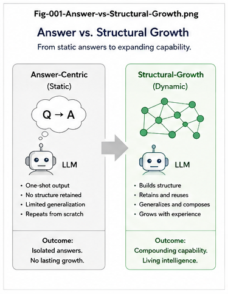
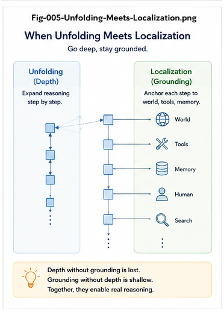
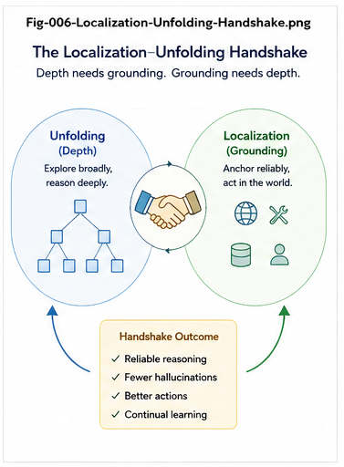

# START HERE — Structural Theory of AI Reasoning

## A 10–15 Minute Guide from Reasoning Answers to Living Structural Reasoning

**Repository:** Structural Theory of AI Reasoning  
**Series:** STAR — Structural Theory of AI Reasoning  
**Purpose:** Fast Entry / Reading Guide / Concept Map

---

# 1. Start with One Question

Modern AI has demonstrated increasingly powerful reasoning.

But a foundational question remains:

> **What is AI reasoning structurally?**

The conventional picture is:

\[
Question
\rightarrow
Reasoning
\rightarrow
Answer
\]

This repository proposes that this picture is incomplete.

A richer model is:

\[
\boxed{
Question / Goal
\rightarrow
Reasoning\ Structure
\rightarrow
Reasoning
\rightarrow
Answer
+
Structural\ Delta
}
\]

If the Structural Delta is validated and preserved:

\[
S_t
\rightarrow
S_{t+1}
\]

then future reasoning begins from a changed intelligence structure.

Therefore:

\[
\boxed{
Reasoning
\rightarrow
Structural\ Growth
\rightarrow
Future\ Reasoning
}
\]

This is the starting point of the repository.

---

# 2. The First Distinction: Answer vs. Reasoning Structure

Start with:



There are two different questions:

### Question A

> Did the AI produce a good answer?

### Question B

> Did the reasoning process create useful structure that can improve future reasoning?

These are not the same.

An answer may disappear after the reasoning episode.

A validated structural result can persist.

Thus:

\[
\boxed{
Reasoning\ Answer
\neq
Reasoning\ Structure
}
\]

and:

\[
\boxed{
Reasoning\ Success
\neq
Structural\ Growth
}
\]

unless the useful reasoning result is extracted, validated, and preserved.

---

# 3. The Four Questions of AI Reasoning

The entire repository can be entered through four questions.

## Question 1 — Where?

> Where should reasoning occur?

This is primarily the problem of:

\[
\boxed{
Localization
}
\]

---

## Question 2 — What?

> What intelligence should become operational there?

This is primarily the problem of:

\[
\boxed{
Unfolding
}
\]

---

## Question 3 — What Remains?

> Which reasoning results should become part of future intelligence?

This is the problem of:

\[
\boxed{
Validation
+
Structural\ Preservation
}
\]

---

## Question 4 — What Next?

> What should trigger the next reasoning cycle?

This is the problem of:

\[
\boxed{
Gap
+
Opportunity
}
\]

Therefore the shortest map of the repository is:

\[
\boxed{
Where?
\rightarrow
What?
\rightarrow
What\ Remains?
\rightarrow
What\ Next?
}
\]

Or:

\[
\boxed{
Localization
\rightarrow
Unfolding
\rightarrow
Validation / Growth
\rightarrow
Gap / Opportunity
}
\]

Keep these four questions in mind while reading everything else.

---

# 4. Two Reasoning Directions

The central theory begins from two different but complementary reasoning directions.

## LLM Direction

Large Language Models contain enormous amounts of intelligence in distributed, compressed form.

This repository interprets that condition as:

\[
\boxed{
Folded\ Intelligence
}
\]

During inference, relevant intelligence becomes operational.

Conceptually:

\[
Folded\ Intelligence
\rightarrow
Unfolding
\rightarrow
Reasoning
\]

Thus the characteristic direction is:

\[
\boxed{
Inside
\rightarrow
Outside
}
\]

---

## Structural Intelligence Direction

Structural Intelligence begins from explicit structures such as:

- Differential Trees;
- Classification Trees;
- Action Trees;
- Calling Graphs;
- TaskGraphs;
- Action Calling Graphs;
- CCCs;
- Runtime Invariants.

The reasoning problem is:

> Where inside this large structural space is the relevant reasoning region?

Thus:

\[
Global\ Structural\ Space
\rightarrow
Localization
\rightarrow
Local\ Reasoning
\]

The characteristic direction is:

\[
\boxed{
Outside
\rightarrow
Inside
}
\]

---

# 5. The Central Handshake

Now look at:



and:



The two directions meet:

```text
               LLM

       Folded Intelligence
               |
               v
           UNFOLDING
               |
               v
       +---------------+
       |     LOCAL     |
       |   REASONING   |
       |    REGION     |
       +---------------+
               ^
               |
          LOCALIZATION
               ^
               |
       Structural Space

               SI
```

This gives the central relation:

$$ \boxed{ LLM\ Unfolding \leftrightarrow SI\ Localization } $$

or conceptually:

$$ \boxed{ R_{LLM}^{Unfold} \approx R_{SI}^{Localized} } $$

This does not mean that LLM internal computation and Structural Intelligence use identical mechanisms.

It means that they can approach the same operational reasoning region from opposite directions.

This is the central handshake of the STAR theory.

6. Do Not Reduce LLM Reasoning to Winner-Takes-All

Before going further, inspect:

A simplistic model would describe reasoning as:

$$ Candidates \rightarrow Score \rightarrow Winner $$

But LLM reasoning is richer than this.

LLMs can participate in:

semantic transformation;
abstraction;
hypothesis generation;
analogy;
multi-step dependency construction;
planning;
correction;
synthesis;
Gap Bridging;
Forward Extension.

Therefore:

$$ \boxed{ LLM\ Reasoning > Per\text{-}Node\ Winner\text{-}Takes\text{-}All } $$

Per-Node selection is one reasoning mechanism.

It is not a complete explanation of LLM reasoning.

7. The Folding–Unfolding Interpretation

Now inspect:

Training can be conceptually interpreted as:

$$ Data + Language + Patterns + Relations + Procedures \rightarrow Folded\ Intelligence $$

Inference can then be interpreted as:

$$ \boxed{ Folded\ Intelligence \rightarrow Selective\ Unfolding } $$

Unfolding may transform:

$$ Implicit \rightarrow Explicit $$ $$ Compressed \rightarrow Expanded $$ $$ Latent \rightarrow Operational $$ $$ Potential \rightarrow Reasoning $$

This is a structural interpretation of LLM reasoning.

It is not a claim that the model literally stores explicit hidden reasoning graphs.

8. Why Structural Intelligence Matters

If LLMs already reason, why introduce Structural Intelligence?

Because reasoning requires more than generating intelligent local transformations.

Large systems also need to determine:

where reasoning should happen;
what dependencies already exist;
what is missing;
what has already been solved;
what should be reused;
what action should follow;
what should be validated;
what should persist;
what should trigger the next task.

These are structural problems.

Structural Intelligence makes many of these objects explicit.

9. The Structural Reasoning Stack

Inspect:

A simplified reasoning stack is:

Goal / Question / Event
          |
          v
      LOCALIZATION
          |
          v
       UNFOLDING
          |
          v
 PER-NODE INTELLIGENCE
          |
          v
 STRUCTURAL TRAVERSAL
          |
          v
 GAP / EXTENSION
          |
          v
      TASKGRAPH
          |
          v
       ACTIONCG
          |
          v
        ACTION
          |
          v
      VALIDATION
          |
          v
 STRUCTURAL GROWTH

This is not one algorithm.

It is a division of reasoning labor.

10. Per-Node Intelligence

Once a reasoning region has been localized, different nodes may use different intelligence mechanisms.

For example:

Branching and Scoring
$$ Candidates \rightarrow Score \rightarrow Selection $$
Rules Engine
$$ Conditions \rightarrow Boolean\ Algebra \rightarrow Decision $$
CCC
$$ Condition + Context \rightarrow Computation $$
LLM
$$ Context \rightarrow Semantic\ Reasoning \rightarrow Candidate $$
Solver
$$ FormalProblem \rightarrow Algorithm \rightarrow Solution $$

Thus:

$$ \boxed{ Node_i \rightarrow Reasoner_i } $$

The future need not be:

$$ LLM\ Everywhere $$

It can be:

$$ \boxed{ Best\ Reasoner = f(Node,Context,Goal,Policy) } $$
11. Trees and Graphs Have Different Jobs

A useful simplification is:

$$ \boxed{ Tree \rightarrow Localization } $$

while:

$$ \boxed{ Graph \rightarrow Relation + Traversal + Gap + Extension } $$

A Differential Tree or Classification Tree asks:

Which region?

A Calling Graph asks:

How are the relevant objects connected?

This is an important structural division of labor.

12. Calling Graph as a Reasoning Surface

Suppose a graph contains:

$$ A \rightarrow B \rightarrow C \rightarrow D $$

Reasoning can traverse it.

But suppose it contains:

$$ A \rightarrow B \rightarrow ? \rightarrow D $$

Now the missing transition becomes explicit:

$$ \boxed{ Gap } $$

The system no longer receives only a vague request:

Solve the problem.

It can receive:

Bridge Gap \(G_i\) at this structural location.

Thus reasoning becomes:

$$ \boxed{ Addressable } $$
13. Gap Bridging

Gap Bridging is one of the central structural reasoning operations.

$$ Gap \rightarrow Localization \rightarrow Reasoning \rightarrow BridgeCandidate $$

Then:

$$ BridgeCandidate \rightarrow Validation $$

and, if accepted:

$$ Validation \rightarrow StructuralGrowth $$

Therefore:

$$ \boxed{ Gap \rightarrow Bridge \rightarrow Growth } $$

This transforms reasoning into structural extension.

14. Forward Extension

Not all reasoning is repair.

A complete structure may still contain a frontier.

The system may ask:

What useful structure could exist next?

This gives:

$$ \boxed{ Forward\ Extension } $$

Thus:

Gap Bridging
$$ Missing \rightarrow Completion $$
Forward Extension
$$ Frontier \rightarrow Novel\ Structure $$

Together:

$$ \boxed{ Reasoning = Bridge + Extend } $$

at the structural-growth level.

15. TaskGraph and Action Calling Graph

Reasoning eventually needs to connect:

$$ What? $$

with:

$$ How? $$

The TaskGraph represents:

$$ \boxed{ What\ must\ be\ solved? } $$

The Action Calling Graph represents:

$$ \boxed{ How\ can\ it\ be\ done? } $$

Therefore:

$$ \boxed{ TaskGraph \leftrightarrow ActionCG } $$

forms a major reasoning–execution duality.

            GOAL
             |
             v
         TaskGraph
             |
       What to solve?
             |
             v
    Action Calling Graph
             |
        How to act?
             |
             v
           ACTION
16. Core-Preserved Coding and Reasoning

Suppose the Action Calling Graph reaches:

$$ CapabilityGap $$

Then the system may need to create a new executable capability.

This gives:

$$ CapabilityGap \rightarrow CodeGap \rightarrow Core\text{-}Preserved\ Coding $$

After validation:

$$ CodeCore_t \rightarrow CodeCore_{t+1} $$

The ActionCG expands.

That allows the TaskGraph to advance.

Therefore:

$$ \boxed{ Coding\ Progress \rightarrow Reasoning\ Progress } $$

and:

$$ \boxed{ Core\text{-}Preserved\ Coding \leftrightarrow Core\text{-}Preserved\ Reasoning } $$

become dual growth methods.

17. Reasoning Can Produce Structural Delta

The result of reasoning need not be only:

$$ Answer $$

It can also produce:

$$ \Delta S $$

Examples include:

new node;
new edge;
new classification;
new rule;
new CCC;
new task;
new ActionCG branch;
new bridge;
new Runtime Invariant;
new reusable reasoning path.

Thus:

$$ \boxed{ ReasoningOutput = Answer + CandidateStructuralDelta } $$

This is the transition from answer-centric reasoning to cumulative reasoning.

18. But Generated Structure Is Not Knowledge Yet

A critical boundary is:

$$ \boxed{ Generated\Delta S \neq Validated\Delta S } $$

The lifecycle should be:

Generate
   |
   v
Extract
   |
   v
Compare
   |
   v
Validate
   |
   v
Promote
   |
   v
Preserve

Only then should:

$$ S_t $$

be changed into:

$$ S_{t+1} $$

This prevents speculative model output from automatically becoming persistent intelligence.

19. The Living Reasoning Loop

Now inspect:

This is where the repository moves beyond ordinary QA.

Let:

$$ S_t $$

represent the current Structural Intelligence state.

Reasoning produces:

$$ \Delta S_t $$

After validation:

$$ S_{t+1} = S_t \oplus Validated(\Delta S_t) $$

Future reasoning operates on:

$$ S_{t+1} $$

Therefore:

$$ \boxed{ S_t \rightarrow R_t \rightarrow \Delta S_t \rightarrow S_{t+1} \rightarrow R_{t+1} } $$

The previous reasoning episode changes the substrate of future reasoning.

This is the:

$$ \boxed{ Living\ Reasoning\ Loop } $$
20. "Living" Does Not Mean Endless Thinking

Living Reasoning does not mean:

$$ ReasonForever() $$

It means:

Validated reasoning can modify persistent intelligence, and the modified intelligence can participate in or initiate future reasoning.

Thus:

$$ \boxed{ Living = Persistent + Operational + Evolving } $$

A living reasoning system may correctly decide to stop.

Dormancy can itself be intelligent.

21. From Prompt-Driven Reasoning to Structural Triggers

Ordinary conversational reasoning begins with:

$$ HumanPrompt \rightarrow Reasoning $$

But explicit structure can generate:

$$ StructuralGap $$

which can become:

$$ Task $$

which can trigger:

$$ Reasoning $$

Thus:

$$ \boxed{ Gap \rightarrow Task \rightarrow Reasoning } $$

The structure itself begins to generate reasoning work.

22. From Gap-Driven to Opportunity-Driven

A more advanced system can identify not only what is missing, but what could be valuable next.

Thus:

$$ Opportunity \rightarrow ForwardExtension $$

The progression becomes:

$$ \boxed{ Prompt\text{-}Driven \rightarrow Gap\text{-}Driven \rightarrow Opportunity\text{-}Driven } $$

or:

$$ \boxed{ Reactive \rightarrow Self\text{-}Correcting \rightarrow Self\text{-}Extending } $$

This provides a structural pathway toward increasing autonomy.

23. The Critical Autonomy Question

A useful way to distinguish reasoning architectures is to ask:

Who or what generates the next reasoning task?

Prompt-Driven AI
$$ Human \rightarrow NextTask $$
Gap-Driven AI
$$ StructuralGap \rightarrow NextTask $$
Opportunity-Driven AI
$$ StructuralOpportunity \rightarrow NextTask $$

This question may be more architecturally useful than asking only how many reasoning steps a model can generate.

24. Future Reasoning Architecture

Finally inspect:

The complete future architecture proposed by this repository can be summarized as:

             GOAL / WORLD / EVENT
                     |
                     v
            GAP / OPPORTUNITY
                     |
                     v
                 LOCALIZE
                     |
                     v
            REASONING REGION
                     |
                     v
                  UNFOLD
                     |
        +------------+------------+
        |            |            |
        v            v            v
       LLM         Solver     Specialist
        |            |            |
        +------------+------------+
                     |
                     v
                  REASON
                     |
                     v
             CANDIDATE DELTA
                     |
                     v
                 VALIDATE
                     |
                     v
            RUNTIME INVARIANTS
                     |
                     v
                 PRESERVE
                     |
                     v
            STRUCTURAL GROWTH
                     |
           +---------+---------+
           |                   |
           v                   v
       TaskGraph            ActionCG
           |                   |
           +---------+---------+
                     |
                     v
                    ACT
                     |
                     v
                  OBSERVE
                     |
                     +------------------->

This is no longer:

$$ Input \rightarrow Model \rightarrow Output $$

It is:

$$ \boxed{ Structure \rightarrow Reason \rightarrow Action \rightarrow Evidence \rightarrow Structure } $$
25. The LLM–SI Map

Keep this table as the conceptual map for the entire repository.

Dimension	LLM-Centered Reasoning	Structural Intelligence
Representation	Folded / distributed	Explicit / structural
Characteristic operation	Unfolding	Localization + traversal
Localization	Mostly implicit / soft	Explicit / addressable
Reasoning unit	Token / latent state / generated step	Node / CCC / tree / graph / task
Branching	Dynamically generated	Can be explicit and persistent
Relations	Often latent	Explicit dependencies
Gap	Usually implicit	First-class structural object
Gap Bridging	Generative	Addressed + generative + validated
Forward Extension	Generative exploration	Structural frontier extension
Per-Node intelligence	Primarily shared model	Heterogeneous mechanisms
Task organization	Usually dynamic	Persistent TaskGraph
Action organization	Tool / agent orchestration	Action Calling Graph
Validation	Self / tools / external	Explicit runtime layer
Persistence	Context / memory / retraining	Structural promotion
Evolution	Model / memory updates	Explicit structural growth
Autonomous trigger	Prompt / agent loop	Gap / opportunity / event
Long-term direction	Better folded reasoning	Living structural reasoning

Do not read this table as:

$$ LLM \ versus \ SI $$

Read it as:

$$ \boxed{ Complementary\ Reasoning\ Functions } $$

whose central handshake is:

$$ \boxed{ Unfolding \leftrightarrow Localization } $$
26. The 10-Minute Reading Route

If you have only 10–15 minutes, read four documents.

Step 1
STAR-001 — What Is AI Reasoning?

Read this first to understand:

$$ \boxed{ Reasoning \neq Answer\ Generation\ Only } $$
Step 2
STAR-005 — LLM Folding and Unfolding

Read this to understand:

$$ \boxed{ LLM = Folding\ Structure } $$

and:

$$ \boxed{ Reasoning = Selective\ Unfolding } $$

as a structural interpretation.

Step 3
STAR-006 — Unfolding Meets Localization

This is the conceptual center of the repository.

It develops:

$$ \boxed{ LLM\ Unfolding \leftrightarrow SI\ Localization } $$
Step 4
STAR-007 — The Living Reasoning Loop

This explains the transition:

$$ Reasoning \rightarrow StructuralGrowth \rightarrow FutureReasoning $$

and:

$$ Prompt \rightarrow Gap \rightarrow Opportunity $$
27. The 30-Minute Reading Route

After the four core papers, add:

STAR-003 — How Structural Intelligence Reasons

for:

Per-Node Intelligence;
trees;
Calling Graphs;
Gap Bridging;
TaskGraphs;
ActionCG.

Then read:

STAR-004 — How Can an LLM Reason?

for the argument that:

$$ \boxed{ LLM\ Reasoning > Winner\text{-}Takes\text{-}All } $$

Finally read:

STAR-008 — Future AI Reasoning Architectures

for the architectural implications:

$$ \boxed{ Monolithic\ Model \rightarrow Reasoning\ Division\ of\ Labor \rightarrow Structural\ Runtime \rightarrow Living\ AI } $$
28. Full Reading Order

For a complete reading:

STAR-001-WHAT-IS-AI-REASONING.md
STAR-002-FROM-ANSWERS-TO-STRUCTURAL-GROWTH.md
STAR-003-HOW-STRUCTURAL-INTELLIGENCE-REASONS.md
STAR-004-HOW-CAN-AN-LLM-REASON.md
STAR-005-LLM-FOLDING-AND-UNFOLDING.md
STAR-006-UNFOLDING-MEETS-LOCALIZATION.md
STAR-007-THE-LIVING-REASONING-LOOP.md
STAR-008-FUTURE-AI-REASONING-ARCHITECTURES.md

The sequence follows:

$$ \boxed{ Definition \rightarrow Growth \rightarrow SI \rightarrow LLM \rightarrow Folding \rightarrow Handshake \rightarrow Living \rightarrow Future } $$
29. Visual Reading Route

The figures provide an even faster route.

Fig-001

Answer vs Structural Growth

Main question:

What remains after reasoning?

Fig-002

Structural Reasoning Stack

Main question:

What structural layers participate in reasoning?

Fig-003

LLM Reasoning Beyond WTA

Main question:

Why is LLM reasoning richer than local candidate selection?

Fig-004

LLM Folding–Unfolding

Main question:

How can learned intelligence become operational reasoning?

Fig-005

Unfolding Meets Localization

Main question:

Where do LLM reasoning and Structural Intelligence meet?

Fig-006

Localization–Unfolding Handshake

Main question:

How can the two reasoning paradigms divide labor?

Fig-007

Living Reasoning Loop

Main question:

How can reasoning improve the substrate of future reasoning?

Fig-008

Future Reasoning Architecture

Main question:

What could the next generation of integrated reasoning systems look like?

30. Eight Figures in One Line

The complete visual progression is:

$$ \boxed{ Answer \rightarrow Structure \rightarrow LLM\ Reasoning \rightarrow Unfolding \rightarrow Localization \rightarrow Handshake \rightarrow Living\ Loop \rightarrow Future\ Architecture } $$

Or even more compactly:

$$ \boxed{ Answer \rightarrow Structure \rightarrow Unfolding \leftrightarrow Localization \rightarrow Growth \rightarrow Living\ AI } $$
31. What Is Established and What Is Hypothetical?

The repository intentionally connects current AI observations with forward-looking architectural hypotheses.

These should not be confused.

Current Empirical Starting Points

Modern LLMs demonstrate:

broad semantic capability;
multi-step reasoning behavior;
abstraction;
planning-like behavior;
tool-mediated reasoning;
substantial generalization.
Structural Interpretation

This repository proposes:

$$ \boxed{ LLM\ as\ Folding } $$

and:

$$ \boxed{ Reasoning\ as\ selective\ Unfolding } $$

as conceptual structural interpretations.

Architectural Proposal

The repository further proposes:

$$ \boxed{ Unfolding \leftrightarrow Localization } $$

as a useful hybrid architecture principle.

Future Hypothesis

More speculative directions include:

$$ \boxed{ Specialized\ Unfolding\ Engine } $$

and potentially:

$$ \boxed{ Folding\ Transformer \leftrightarrow Unfolding\ Transformer } $$

These are research hypotheses, not claims about established model architecture.

32. The Future Division of Labor

A mature reasoning architecture may increasingly divide responsibilities.

Structural Intelligence

Answers:

$$ \boxed{ Where? } $$
LLM / Unfolding Engine

Answers:

$$ \boxed{ What? } $$
Structural Runtime

Answers:

$$ \boxed{ What\ Remains? } $$
Gap / Opportunity Engine

Answers:

$$ \boxed{ What\ Next? } $$

Together:

$$ \boxed{ Where \rightarrow What \rightarrow What\ Remains \rightarrow What\ Next } $$

This is perhaps the shortest architecture-level summary of the entire repository.

33. Why This Matters for Future AI

A model-centered view asks:

How capable is the model?

A structural-runtime view adds:

Where should that capability be used?

Which capability should be used?

What structure does the reasoning operate on?

What new structure did reasoning produce?

Should that structure be preserved?

What task follows from it?

These questions become increasingly important as AI systems become:

persistent;
tool-using;
long-running;
autonomous;
specialized;
multi-model;
safety-critical.

Thus:

$$ \boxed{ Model\ Intelligence \rightarrow System\ Intelligence } $$

is a major architectural transition.

34. Why This Matters for AI Efficiency

Without persistent structure:

$$ Problem \rightarrow ReasonFromScratch $$

again and again.

With validated reusable structure:

$$ Problem \rightarrow Localize \rightarrow Reuse \rightarrow LocalExtension $$

Therefore:

$$ \boxed{ Structural\ Reuse \rightarrow Reduced\ Repeated\ Reasoning } $$

Reasoning becomes capital rather than only expenditure.

35. Why This Matters for AI Explainability

An explicit structural runtime can record:

Why reason?
    Gap G17

Where?
    Node N42

Which reasoner?
    LLM M3

What was generated?
    Delta D8

Why accepted?
    Validation V2

Invariant status?
    PASS

What changed?
    S(t) -> S(t+1)

Thus:

$$ \boxed{ Reasoning \rightarrow Structural\ Trace } $$

provides a different form of explainability from textual self-explanation alone.

36. Why This Matters for AI Governance

Persistent reasoning growth creates a serious question:

What may the AI change?

The repository therefore treats:

$$ Validation $$ $$ Policy $$ $$ Runtime\ Invariants $$ $$ Human\ Escalation $$

as first-class architectural components.

Thus:

$$ \boxed{ Autonomy + Boundaries } $$

rather than:

$$ Unbounded\ Autonomy $$

is the intended direction.

37. Why This Matters for ASI

Within this framework, Autonomous Structural Intelligence is not defined simply as:

$$ VeryLargeModel $$

or:

$$ VeryLongReasoning $$

A more structural interpretation is:

$$ \boxed{ ASI = Self\text{-}Initiated + Localized + Reasoning + Action + Validation + Persistent\ Growth } $$

The important property is closure:

$$ \boxed{ Observe \rightarrow Gap / Opportunity \rightarrow Reason \rightarrow Act \rightarrow Validate \rightarrow Grow \rightarrow Next\ Gap / Opportunity } $$

This repository treats that closure as an architectural research direction, not as a claim that complete ASI already exists.

38. Why This Matters for Collective Learning

The same reasoning loop can extend beyond one AI.

A human or AI can produce:

$$ CandidateStructuralDelta $$

which can be:

$$ Validated $$

then:

$$ Shared $$

then:

$$ Reused $$

by other humans and AIs.

Thus:

$$ \boxed{ Individual\ Reasoning \rightarrow Shared\ Structural\ Capital } $$

and:

$$ \boxed{ Collective\ Learning = Living\ Reasoning\ at\ Social\ Scale } $$

becomes a possible long-term direction.

39. What Not to Misread

This repository does not argue:

$$ LLM\ is\ weak $$

and therefore:

$$ SI\ should\ replace\ LLM $$

The intended conclusion is almost the opposite.

LLMs reveal how powerful folded intelligence can be.

Structural Intelligence reveals how explicit structure can improve:

localization;
coordination;
persistence;
validation;
reuse;
governance;
growth.

Therefore:

$$ \boxed{ LLM + Structural\ Intelligence } $$

is the main direction.

The key word is:

$$ \boxed{ Complementarity } $$
40. Five Ideas to Remember

If you remember only five ideas from this repository, remember these.

1. Reasoning Is More Than Answer Generation
$$ \boxed{ Reasoning \rightarrow Answer + Structural\ Delta } $$
2. LLMs Can Be Viewed as Folding Structures
$$ \boxed{ Folded\ Intelligence \rightarrow Unfolding } $$
3. Structural Intelligence Provides Localization
$$ \boxed{ Global\ Structure \rightarrow Local\ Reasoning\ Region } $$
4. Unfolding and Localization Can Meet
$$ \boxed{ LLM\ Unfolding \leftrightarrow SI\ Localization } $$
5. Reasoning Can Become Living
$$ \boxed{ Reason \rightarrow Grow \rightarrow Reason\ Again } $$

These five ideas are the backbone of the repository.

41. Three Equations to Remember

If you remember only three equations:

Equation 1
$$ \boxed{ R_{LLM}^{Unfold} \approx R_{SI}^{Localized} } $$
Equation 2
$$ \boxed{ S_t \rightarrow R_t \rightarrow \Delta S_t \rightarrow S_{t+1} } $$
Equation 3
$$ \boxed{ Prompt \rightarrow Gap \rightarrow Opportunity } $$

Together they describe:

the LLM–SI handshake;
cumulative reasoning;
increasing reasoning autonomy.
42. One Canonical Pipeline

The full repository can be compressed into:

$$ \boxed{ FOLD \rightarrow LOCALIZE \rightarrow UNFOLD \rightarrow REASON \rightarrow BRIDGE \rightarrow ACT \rightarrow VALIDATE \rightarrow GROW \rightarrow REFOLD } $$

Each term has a distinct role.

FOLD

Compress intelligence into reusable representations.

LOCALIZE

Determine where reasoning belongs.

UNFOLD

Activate relevant folded intelligence.

REASON

Perform local and structural computation.

BRIDGE

Resolve gaps or extend structural frontiers.

ACT

Change the external or computational environment.

VALIDATE

Test generated results.

GROW

Preserve useful validated structure.

REFOLD

Compress mature structural knowledge into higher-level reusable intelligence.

Then the cycle begins again.

43. One Canonical Architecture
             FOLDED INTELLIGENCE
                     |
                     v
                  UNFOLD
                     |
                     |
                     v
            LOCAL REASONING REGION
                     ^
                     |
                     |
                  LOCALIZE
                     ^
                     |
            STRUCTURAL INTELLIGENCE
                     |
                     v
             STRUCTURAL TRAVERSAL
                     |
                     v
              GAP / EXTENSION
                     |
                     v
             CANDIDATE DELTA
                     |
                     v
                 VALIDATE
                     |
                     v
                  GROW
                     |
                     v
            UPDATED STRUCTURE
                     |
                     +------------------->

The two sides meet at:

$$ \boxed{ Local\ Reasoning\ Region } $$

The loop closes at:

$$ \boxed{ Updated\ Structure } $$
44. One-Sentence Theory

AI reasoning is the process by which intelligence is localized, unfolded, structurally operated, validated, and potentially preserved as part of the starting structure for future reasoning.

45. One-Sentence Future Architecture

Future AI reasoning may increasingly combine folded model intelligence with explicit Structural Localization, heterogeneous reasoning engines, structural runtimes, validation, and persistent growth.

46. One-Sentence Living Reasoning Definition

Reasoning becomes living when validated reasoning changes the structure from which future reasoning begins, and that evolving structure can help generate the next reasoning task.

47. Repository Map
Structural-Theory-of-AI-Reasoning/
│
├── README.md
├── START-HERE.md
│
├── STAR-001-WHAT-IS-AI-REASONING.md
├── STAR-002-FROM-ANSWERS-TO-STRUCTURAL-GROWTH.md
├── STAR-003-HOW-STRUCTURAL-INTELLIGENCE-REASONS.md
├── STAR-004-HOW-CAN-AN-LLM-REASON.md
├── STAR-005-LLM-FOLDING-AND-UNFOLDING.md
├── STAR-006-UNFOLDING-MEETS-LOCALIZATION.md
├── STAR-007-THE-LIVING-REASONING-LOOP.md
├── STAR-008-FUTURE-AI-REASONING-ARCHITECTURES.md
│
└── figures/
    ├── Fig-001-Answer-vs-Structural-Growth.png
    ├── Fig-002-Structural-Reasoning-Stack.png
    ├── Fig-003-LLM-Reasoning-Beyond-WTA.png
    ├── Fig-004-LLM-Folding-Unfolding.png
    ├── Fig-005-Unfolding-Meets-Localization.png
    ├── Fig-006-Localization-Unfolding-Handshake.png
    ├── Fig-007-Living-Reasoning-Loop.png
    └── Fig-008-Future-Reasoning-Architecture.png
48. Where to Go Next

If your main interest is:

LLM Reasoning

Read:

STAR-004
STAR-005
STAR-006
Structural Intelligence

Read:

STAR-002
STAR-003
STAR-006
AI Agents / Autonomous AI

Read:

STAR-003
STAR-007
STAR-008
Future AI Architecture

Read:

STAR-005
STAR-006
STAR-008
ASI / Living Intelligence

Read:

STAR-007
STAR-008
AI Coding

Focus on:

$$ CallingGraph \rightarrow ActionCG \rightarrow Core\text{-}Preserved\ Coding $$

inside STAR-003, STAR-007, and STAR-008.

49. Final Map

The repository begins with:

$$ \boxed{ What\ is\ AI\ reasoning? } $$

It then separates:

$$ \boxed{ Answer } $$

from:

$$ \boxed{ Reasoning\ Structure } $$

It identifies two complementary reasoning directions:

$$ \boxed{ LLM \rightarrow Unfolding } $$

and:

$$ \boxed{ SI \rightarrow Localization } $$

It brings them together:

$$ \boxed{ Unfolding \leftrightarrow Localization } $$

It connects reasoning to explicit structural growth:

$$ \boxed{ Gap \rightarrow Bridge \rightarrow Structural\ Delta } $$

It connects reasoning to action:

$$ \boxed{ TaskGraph \leftrightarrow ActionCG } $$

It connects action to executable growth:

$$ \boxed{ Core\text{-}Preserved\ Coding } $$

It connects reasoning output to future intelligence:

$$ \boxed{ S_t \rightarrow S_{t+1} } $$

And finally it closes the loop:

$$ \boxed{ Reasoning \rightarrow Structural\ Growth \rightarrow New\ Reasoning } $$

That closed loop is:

$$ \boxed{ Living\ Structural\ Reasoning } $$
50. Start Here

If you are opening this repository for the first time:

First:

Look at:

Fig-001 — Answer vs Structural Growth

Then read:

STAR-001 — What Is AI Reasoning?

Second:

Look at:

Fig-004 — LLM Folding and Unfolding

Then read:

STAR-005 — LLM Folding and Unfolding

Third:

Look at:

Fig-005 — Unfolding Meets Localization

and:

Fig-006 — Localization–Unfolding Handshake

Then read:

STAR-006 — Unfolding Meets Localization

Fourth:

Look at:

Fig-007 — Living Reasoning Loop

Then read:

STAR-007 — The Living Reasoning Loop

Finally:

Look at:

Fig-008 — Future Reasoning Architecture

Then read:

STAR-008 — Future AI Reasoning Architectures

At that point, the full repository can be compressed into one line:

$$ \boxed{ \textbf{ Answer \rightarrow Structure \rightarrow Unfolding \leftrightarrow Localization \rightarrow Growth \rightarrow Living\ Intelligence } } $$

And into one final question:

Can AI reasoning evolve from producing answers to building, validating, reusing, and extending the structural intelligence from which its next reasoning begins?

That is the research question at the center of the Structural Theory of AI Reasoning.


